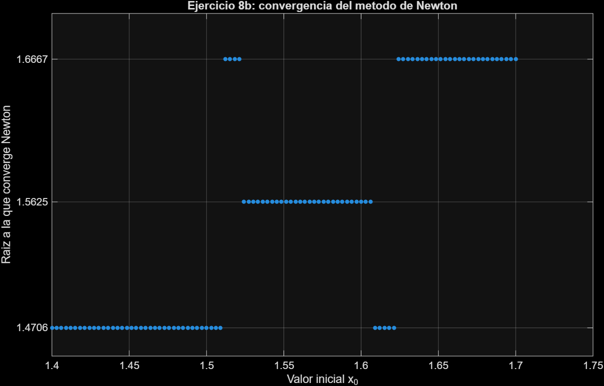

```{=latex}
\setcounter{page}{0} 
```
# Parte programada

## Ejercicio 1

Ver programación en el archivo `Tarea_1_MA0501_Grupo_03.m`

## Ejercicio 2

Ver programación en el archivo `Tarea_1_MA0501_Grupo_03.m`, en la sección `Solucion de incisos: creacion de funciones`, en el apartado  `Ejercicio 2`. 


# Parte teórica - programada

## Ejercicio 3
Tenemos:

$$
2(\alpha+2)x+\alpha\sin(2x)=0,
\qquad \alpha\in\mathbb{R}
\tag{1}
$$

### a) Determine los valores de $\alpha$ para que $(1)$ tenga solución en $[1,2]$.

**TVI:** Si $f:[a,b]\rightarrow\mathbb{R}$ es continua en $[a,b]$ y

$$
f(a)\leq L\leq f(b)
$$

entonces

$$
\exists\,c\in[a,b]\quad\text{tal que}\quad f(c)=L.
$$

Definimos:

$$
f(x)=2(\alpha+2)x+\alpha\sin(2x)
$$

$f$ es continua en $[1,2]$, pues es la suma de una función lineal, la cual es continua, y una función trigonométrica. Sabemos que la composición de funciones continuas es continua.

Por lo tanto,

$$
\Rightarrow f\text{ es continua en }[1,2].
$$

Vea que:

$$
f(1)=2(\alpha+2)\cdot1+\alpha\sin(2) =\alpha(2+\sin(2))+4
$$

y

$$
f(2)=2(\alpha+2)\cdot2+\alpha\sin(2\cdot2) = \alpha(4+\sin(4))+8.
$$


Para que $f$ tenga solución en $[1,2]$ debe cumplirse que $$f(1)\cdot f(2)\leq0.$$


Si $$f(1)=0 \Rightarrow \alpha(2+\sin(2))+4=0 $$

por lo que

$$
\alpha=-\frac{4}{2+\sin(2)}
\approx -1.3749.
$$

Ahora, si

$$ f(2)=0 \Rightarrow \alpha(4+\sin(4))+8=0 $$
por lo que

$$
\alpha=-\frac{8}{4+\sin(4)}
\approx -2.4667.
$$

Dado que las pendientes de $$ f(1)=\alpha(2+\sin(2))+4 $$ y $$ f(2)=\alpha(4+\sin(4))+8 $$ son positivas, entonces las funciones de $\alpha$ son crecientes.

Por lo tanto, los valores de $\alpha$ para los que el TVI garantiza al menos una solución en el intervalo $[1,2]$ son:

$$
\alpha\in
\left[
-\frac{8}{4+\sin(4)},
-\frac{4}{2+\sin(2)}
\right]
$$

es decir,

$$
\alpha\in[-2.4667,-1.3749].
$$

Por lo tanto, el TVI garantiza al menos una solución en $[1,2]$ si y solo si $\alpha \in [-2.4667, -1.3749]$.

### b) Muestre que la ecuación (1) se puede escribir como un problema de hallar un punto fijo de $x=\varphi(x)$ 

Tenemos:

$$
2(\alpha+2)x+\alpha\sin(2x)=0
$$

$$
\Rightarrow 2\alpha x+4x+\alpha\sin(2x)=0
$$

$$
\Rightarrow 4x=-2\alpha x-\alpha\sin(2x)
$$

$$
\Rightarrow x=-\frac{\alpha x}{2}-\frac{\alpha\sin(2x)}{4}
$$

Por lo tanto:

$$
\varphi(x)=-\frac{\alpha x}{2}
-\frac{\alpha\sin(2x)}{4}
$$


Ahora, vea que $\varphi(x)$ es continua ya que es una resta de funciones continuas. Además,

$$\varphi(1) = \frac{-\alpha \cdot 1}{2} - \frac{\alpha \sin(2 \cdot 1)}{4} = -\alpha \left( \frac{1}{2} + \frac{\sin(2)}{4} \right)$$

$$\varphi(2) = \frac{-\alpha \cdot 2}{2} - \frac{\alpha \sin(2 \cdot 2)}{4} = -\alpha \left( 1 + \frac{\sin(4)}{4} \right)$$

Necesitamos que: $\varphi(x) \in [1,2] \quad \forall x \in [1,2]$

Para $\varphi(1)$:

$$\Rightarrow 1 \leq -\alpha \left( \frac{1}{2} + \frac{\sin(2)}{4} \right) \leq 2 \quad $$

$$\Rightarrow -2 \leq \alpha \left( \frac{1}{2} + \frac{\sin(2)}{4} \right) \leq -1$$

$$\Rightarrow \frac{-2}{\frac{1}{2} + \frac{\sin(2)}{4}} \leq \alpha \leq \frac{-1}{\frac{1}{2} + \frac{\sin(2)}{4}}$$

$$\Rightarrow \frac{-2}{\frac{2 + \sin(2)}{4}} \leq \alpha \leq \frac{-1}{\frac{2 + \sin(2)}{4}}$$

$$\Rightarrow \frac{-8}{2 + \sin(2)} \leq \alpha \leq \frac{-4}{2 + \sin(2)}$$

$$\Rightarrow -2,7498 \leq \alpha \leq -1,3749$$

Para $\varphi(2)$:

$$1 \leq -\alpha \left( 1 + \frac{\sin(4)}{4} \right) \leq 2$$

$$\Rightarrow \frac{-2}{1 + \frac{\sin(4)}{4}} \leq \alpha \leq \frac{-1}{1 + \frac{\sin(4)}{4}}$$

$$\Rightarrow -2,4667 \leq \alpha \leq -1,2334$$

Por lo que:

$$\alpha \in \left[ -2.7498, -1.3749 \right] \cap \left[ -2.4667, -1.2334 \right]$$

$$\Rightarrow \alpha \in \left[ -2.4667, -1.3749 \right]$$

### c) Justifique si es mejor el método de bisección en la ecuación $(1)$ o el método de punto fijo en la ecuación $x=\varphi(x)$ con base en lo obtenido en a) y b).

Como se puede observar, $\alpha$ pertenece al mismo intervalo en el inciso a y b; así que ambos métodos comprobarán la existencia de una solución para ese intervalo. Pero para saber si el método de punto fijo converge, habría que comprobar que $|\varphi'(x)| \leq L$ para $0 < L < 1$ $\forall x \in \left]1,2\right[$ lo que implicaría cálculos extra a los realizados en a) y b). Por otro lado, el método de bisección solamente necesita la verificación de que $f(a) \cdot f(b) \leq 0$ lo cual ya fue comprobado en el inciso a); es por esto que el método de bisección sería mejor para este caso.

### d) Aplique el método de punto fijo y determine una aproximación para la solución de $(1)$, con una tolerancia de $10^{-4}$ empleando el error relativo en cada iteración. Use $x_0 = 1$ y $\alpha = -2$.

Tenemos $f(x) = 2(\alpha+2)x + \alpha \sin(2x)$

Necesitamos llegar a $x = g(x)$; para $x = \varphi(x)$, del inciso b) obtuvimos:

$$\varphi(x) = \frac{-\alpha x}{2} - \frac{\alpha \sin(2x)}{4}$$

Para $\alpha = -2$

$$\varphi(x) = x + \frac{\sin(2x)}{2}$$

Tenemos $tol = 10^{-4}$; $x_0 = 1$; $e_k = \dfrac{|x_{k+1} - x_k|}{|x_{k+1}|}$

Como $x_0 = 1$

$$\Rightarrow x_1 = 1 + \frac{\sin(2 \cdot 1)}{2} \approx 1,45465$$

$$\Rightarrow e_0 = \frac{|1,45465 - 1|}{|1,45465|} = \frac{0,45465}{1,45465} \approx 0,31255 > 10^{-4}$$

Ahora, $x_2 = 1,45465 + \dfrac{\sin(2 \cdot 1,45465)}{2} \approx 1,56975$

$$\Rightarrow e_1 = \frac{|1,56975 - 1,45465|}{|1,56975|} \approx 0,07333 > 10^{-4}$$

Ahora, $x_3 = 1,56975 + \dfrac{\sin(2 \cdot 1,56975)}{2} \approx 1,57080$

$$\Rightarrow e_2 = \frac{|1,57080 - 1,56975|}{|1,57080|} \approx 6,66111 \times 10^{-4} > 10^{-4}$$

Ahora, $x_4 = 1,57080 + \dfrac{\sin(2 \cdot 1,57080)}{2} = \frac{\pi}{2}$

$$\Rightarrow e_3 = \frac{|\frac{\pi}{2} - 1,57080|}{|\frac{\pi}{2}|} \approx 2,33844 \times 10^{-6} < 10^{-4}$$

Como se llegó a que el error relativo es menor que la tolerancia entonces usamos $x_4$ como la aproximación a la solución para la ecuación $(1)$, con

$$x_4 = \frac{\pi}{2} \approx 1,57080$$

con un error relativo de $e_3 \approx 2,33844 \times 10^{-6} < 10^{-4}$.

## Ejercicio 4

Considere la sucesión definida por:
  
$$x_{k+1} = \frac{20x_k + \dfrac{21}{x_k^2}}{21}, \qquad k \geq 1 \tag{2}$$
    
### a) Muestre que el límite cuando $k \to \infty$ de la sucesión (2) es $\sqrt[3]{21}$
    
Defina $g(x) = \dfrac{20x + \frac{21}{x^2}}{21}$, de forma que la sucesión (2) corresponde a la iteración de punto fijo $x_{k+1} = g(x_k)$.
    
Note que si $x_0 > 0$, entonces $g(x_0) > 0$, ya que tanto $20x_0$ como $\frac{21}{x_0^2}$ son positivos; por lo tanto, toda la sucesión permanece en los reales positivos.
    
Supongam que la sucesión converge, es decir, que existe $L = \lim_{k\to\infty} x_k$. Como $g$ es continua para $x \neq 0$, al tomar límite en ambos lados de (2) se obtiene:
      
$$L = \frac{20L + \frac{21}{L^2}}{21}$$
      
$$\Rightarrow 21L = 20L + \frac{21}{L^2}$$
      
$$\Rightarrow L = \frac{21}{L^2}$$
      
$$\Rightarrow L^3 = 21$$
      
Como $L > 0$ (pues toda la sucesión es positiva), se concluye que la única solución posible es:
      
$$L = \sqrt[3]{21}$$
      
Ahora, para garantizar que la sucesión efectivamente converge a este valor, se verifica la condición del Teorema de Convergencia Local del punto fijo: basta con que $g$ sea derivable cerca de $L$ y que $|g'(L)| < 1$.

Calculando la derivada:

$$g'(x) = \frac{20}{21} - \frac{2}{x^3}$$
      
Evaluando en $L = \sqrt[3]{21}$, es decir, usando que $L^3 = 21$:
      
$$g'(L) = \frac{20}{21} - \frac{2}{21} = \frac{18}{21} = \frac{6}{7} \approx 0,85714$$

Como $|g'(L)| = \frac{6}{7} < 1$, se cumple la condición del teorema, por lo que existe un intervalo alrededor de $L$ dentro del cual la iteración de punto fijo converge a $L$. Los resultados numéricos del inciso c) confirman que, en efecto, con $x_0 = 1$ la sucesión se aproxima cada vez más a $L$. Por lo tanto:
  
$$\lim_{k \to \infty} x_k = \sqrt[3]{21}$$
    
### b) Determine el orden de convergencia de la sucesión (2). Explique si la convergencia es cuadrática
    
Del inciso a) se obtuvo que:
  
$$g'(L) = \frac{6}{7} \neq 0$$

Por la teoría de convergencia de iteraciones de punto fijo, si $g'(L) \neq 0$, entonces el método converge con orden 1 (convergencia lineal), y no con orden 2. Esto se puede justificar formalmente usando el Teorema de Taylor: si $e_k = x_k - L$ es el error en la iteración
$k$, entonces

$$e_{k+1} = x_{k+1} - L = g(x_k) - g(L) \approx g'(L)\,e_k + O(e_k^2)$$

de donde

$$\lim_{k\to\infty} \frac{e_{k+1}}{e_k} = g'(L) = \frac{6}{7}$$
  
Como este límite es una constante distinta de cero (y no el límite $\lim \frac{e_{k+1}}{e_k^2}$ el que resulta finito y distinto de cero), la convergencia es lineal, no cuadrática, con constante asintótica de error $\frac{6}{7} \approx 0,857$.

### c) Realice 4 iteraciones de (2) para aproximar $\sqrt[3]{21}$ con $x_0 = 1$. Calcule el error absoluto en cada iteración

Usando $x_{k+1} = \dfrac{20x_k + \frac{21}{x_k^2}}{21}$. Como en este caso sí se conoce el valor exacto $\sqrt[3]{21} \approx 2,75892418$, el error absoluto en cada iteración se calcula con la definición formal $E_{a,k} = |\sqrt[3]{21} - x_k|$, y no como la diferencia entre iteraciones consecutivas.

**Iteración 1:**
$$
x_1 = \frac{20(1) + \frac{21}{1^2}}{21} = \frac{41}{21} \approx 1,95238
$$
$$
E_{a,1} = |\sqrt[3]{21} - x_1| = |2,75892418 - 1,95238| \approx 0,80654
$$

**Iteración 2:**
$$
x_2 = \frac{20(1,95238) + \frac{21}{(1,95238)^2}}{21} \approx 2,12175
$$
$$
E_{a,2} = |\sqrt[3]{21} - x_2| = |2,75892418 - 2,12175| \approx 0,63717
$$

**Iteración 3:**
$$
x_3 = \frac{20(2,12175) + \frac{21}{(2,12175)^2}}{21} \approx 2,24285
$$
$$
E_{a,3} = |\sqrt[3]{21} - x_3| = |2,75892418 - 2,24285| \approx 0,51607
$$

**Iteración 4:**
$$
x_4 = \frac{20(2,24285) + \frac{21}{(2,24285)^2}}{21} \approx 2,33484
$$
$$
E_{a,4} = |\sqrt[3]{21} - x_4| = |2,75892418 - 2,33484| \approx 0,42408
$$

Así, con 4 iteraciones se obtiene la aproximación $x_4 \approx 2,33484$, con un error absoluto de $E_{a,4} \approx 0,42408$. Note que el error se reduce poco de una iteración a otra (de $0,80654$ a $0,42408$ en 4 iteraciones), reflejo directo de la convergencia lineal obtenida en el inciso b).

### d) Calcule $\sqrt[3]{21}$ con redondeo a 8 decimales y determine el número de dígitos significativos del resultado obtenido en c)

Calculando directamente:

$$\sqrt[3]{21} \approx 2,75892418$$

Para determinar el número de dígitos significativos de $x_4 \approx 2,33484$ respecto al valor exacto, se calcula el error relativo:

$$E_r = \frac{|\sqrt[3]{21} - x_4|}{|\sqrt[3]{21}|} = \frac{|2,75892418 - 2,33484|}{2,75892418} \approx \frac{0,42408}{2,75892} \approx 0,15371$$

es decir, un error relativo de aproximadamente $15,37\%$. Usando el criterio de que $x_4$ tiene $n$ dígitos significativos correctos si $E_r \leq 0,5\times10^{-n}$, se tiene que $E_r \approx 0,15371 \leq 0,5\times10^{0} = 0,5$, pero $E_r > 0,5\times10^{-1}=0,05$. Por lo tanto, $n = 0$: la aproximación $x_4$ no alcanza siquiera un dígito significativo correcto.

Esto es consistente con lo encontrado en el inciso b): como la convergencia de esta sucesión es lineal con una constante asintótica $\frac{6}{7} \approx 0,857$ (muy cercana a $1$), el error se reduce muy lentamente en cada iteración, por lo que después de solo 4 iteraciones todavía se está lejos del valor real $\sqrt[3]{21}$.

### e) Programe una función que aproxime $\sqrt[3]{21}$ usando la sucesión (2)

Ver programación en el archivo `Tarea_1_MA0501_Grupo_03.m`

## Ejercicio 5

### a) Determine explícitamente la matriz A.

Para determinar explícitamente la matriz original A, el procedimiento a seguir consiste en aplicar a la matriz resultante las operaciones inversas a las realizadas inicialmente, desde la última operación hasta la primer operación. Por ejemplo, en caso de aplicarse en un inicio una suma de filas, ahora se aplicará una resta de filas y en caso de aplicarse en un inicio una resta de filas, ahora se aplicará una suma de filas. El orden de las operaciones a efectuar a la matriz resultante es el siguiente:

1.  $f4 + f2$

2.  $f3 - \frac{1}{2} f2$

3.  $f4 - 4f1$

4.  $f3 + 3f1$

5.  $f2 + \frac{1}{2}f1$

Además, la matriz resultante está dada por:

$$\begin{bmatrix}7&-1&2&9\\0&-1&-3&0\\0&0&5&2\\0&0&10&4\end{bmatrix}$$ Efectuando las operaciones detalladas a la matriz anterior, se obtiene:

1.  $f4 + f2$

$$= \begin{bmatrix}7&-1&2&9\\0&-1&-3&0\\0&0&5&2\\0+0&0-1&10-3&4+0\end{bmatrix} = \begin{bmatrix}7&-1&2&9\\0&-1&-3&0\\0&0&5&2\\0&-1&7&4\end{bmatrix}$$

2.  $f3 - \frac{1}{2} f2$

$$= \begin{bmatrix}7&-1&2&9\\0&-1&-3&0\\0-(\frac{1}{2}*0)&0-(\frac{1}{2}*-1)&5-(\frac{1}{2}*-3)&2-(\frac{1}{2}*0)\\0&-1&7&4\end{bmatrix} = \begin{bmatrix}7&-1&2&9\\0&-1&-3&0\\0&\frac{1}{2}&\frac{13}{2}&2\\0&-1&7&4\end{bmatrix}$$

3.  $f4 - 4f1$

$$= \begin{bmatrix}7&-1&2&9\\0&-1&-3&0\\0&\frac{1}{2}&\frac{13}{2}&2\\0-(4 * 7)&-1 - (4 *-1) &7 - (4 * 2)&4 - (4*9)\end{bmatrix} = \begin{bmatrix}7&-1&2&9\\0&-1&-3&0\\0&\frac{1}{2}&\frac{13}{2}&2\\-28&3&-1&-32\end{bmatrix}$$ 4. $f3 + 3f1$

$$= \begin{bmatrix}7&-1&2&9\\0&-1&-3&0\\0+(3*7)&\frac{1}{2}+(3*-1)&\frac{13}{2}+(3*2)&2+(3*9)\\-28&3&-1&-32\end{bmatrix}= \begin{bmatrix}7&-1&2&9\\0&-1&-3&0\\21&\frac{-5}{2}&\frac{25}{2}&29\\-28&3&-1&-32\end{bmatrix}$$

5.  $f2 + \frac{1}{2}f1$

$$= \begin{bmatrix}7&-1&2&9\\0+(\frac{1}{2}*7)&-1+(\frac{1}{2}*-1)&-3+(\frac{1}{2}*2)&0+(\frac{1}{2}*9)\\21&\frac{-5}{2}&\frac{25}{2}&29\\-28&3&-1&-32\end{bmatrix} = \begin{bmatrix}7&-1&2&9\\\frac{7}{2}&\frac{-3}{2}&-2&\frac{9}{2}\\21&\frac{-5}{2}&\frac{25}{2}&29\\-28&3&-1&-32\end{bmatrix}$$ En vista de lo anterior, se tiene que la matriz A corresponde a:

$$A = \begin{bmatrix}7&-1&2&9\\\frac{7}{2}&\frac{-3}{2}&-2&\frac{9}{2}\\21&\frac{-5}{2}&\frac{25}{2}&29\\-28&3&-1&-32\end{bmatrix}$$

### b) Justifique si es posible garantizar que A posee factorización LU única.

Por teorema se tiene que si A es una matriz no singular y se puede escribir como $A = LU$, con L una matriz triangular inferior unitaria y U una matriz triangular superior, entonces la factorización es única.

Primero, se verifica si A es una matriz no singular. Es preciso recordar que una matriz singular corresponde a una matriz cuadrada cuyo determinante es igual a cero. Calculando el determinante de A mediante el método de Gauss:

1.  $f2 - \frac{1}{2}f1,\quad$ $f3 - 3f1,\quad$ $f4 + 4f1$

$$= \begin{bmatrix}7&-1&2&9\\\frac{7}{2} - (\frac{1}{2}*7) &\frac{-3}{2} - (\frac{1}{2} * -1)&-2 - (\frac{1}{2} *2)&\frac{9}{2} - (\frac{1}{2} * 9)\\21 - (3*7)&\frac{-5}{2} - (3*-1)&\frac{25}{2} - (3*2)&29 - (3*9)\\-28 + (4*7)&3 + (4*-1)&-1 + (4*2)&-32 + (4*9)\end{bmatrix} = \begin{bmatrix}7&-1&2&9\\0&-1&-3&0\\0&\frac{1}{2}&\frac{13}{2}&2\\0&-1&7&4\end{bmatrix}$$

2.  $f3 + \frac{1}{2}*f2,\quad$ $f4 - f2$

$$= \begin{bmatrix}7&-1&2&9\\0&-1&-3&0\\0 +(\frac{1}{2}*0)&\frac{1}{2}+(\frac{1}{2}*-1)&\frac{13}{2}+(\frac{1}{2}*-3)&2 +(\frac{1}{2}*0)\\0-0&-1--1&7--3&4-0\end{bmatrix} = \begin{bmatrix}7&-1&2&9\\0&-1&-3&0\\0&0&5&2\\0&0&10&4\end{bmatrix}$$ 3. $f4 - 2f3$

$$= \begin{bmatrix}7&-1&2&9\\0&-1&-3&0\\0&0&5&2\\0 - 2*0&0 - 2*0&10 - 2*5&4 - 2*2\end{bmatrix} =  \begin{bmatrix}7&-1&2&9\\0&-1&-3&0\\0&0&5&2\\0&0&0&0\end{bmatrix} $$ De esta manera, finalmente el $det(A)$ se calcula como: $$det(A) = 7 * -1 * 5 * 0 = 0$$

Note que a partir del procedimiento anterior, es posible visualizar que A es una matriz singular: constituye una matriz cuadrada cuyo determinante es igual a cero. De esta forma se incumple el requisito de no singularidad del teorema, por lo que no es posible garantizar que la matriz A posee una factorización LU única.

### c) Con ayuda de la factorización LU de A, encuentre el conjunto solución del sistema lineal $Ax = b, \text{donde } b:=\left(31,\frac{3}{2},124,-90\right)^T.$

Primero, se desarrolla la factorización LU de la matriz A. Note que en el inciso anterior se construyó la matriz triangular superior a partir de A, la cual en el presente ejercicio se define como: 
$$ U = \begin{bmatrix}7&-1&2&9\\0&-1&-3&0\\0&0&5&2\\0&0&0&0\end{bmatrix} $$ 
Por otro lado, la matriz triangular inferior unitaria L, se construye a partir de los coeficientes utilizados para generar la matriz triangular superior U, los cuales se toman de igual manera del inciso anterior y se define la matriz de la forma:

$$ L = \begin{bmatrix}1&0&0&0\\\frac{1}{2}&1&0&0\\3&\frac{-1}{2}&1&0\\-4&1&2&1\end{bmatrix} $$ 

Así, se ha encontrado que: 

$$ A = LU = \begin{bmatrix}1&0&0&0\\\frac{1}{2}&1&0&0\\3&\frac{-1}{2}&1&0\\-4&1&2&1\end{bmatrix} * \begin{bmatrix}7&-1&2&9\\0&-1&-3&0\\0&0&5&2\\0&0&0&0\end{bmatrix} $$ 

Ahora, el sistema planteado en el enunciado corresponde a $Ax = b$, reemplazando $A = LU$ se obtiene la expresión $LUx = b$. Defina $y= Ux$, así se tiene que $Ly = b$, desarrollando:

$$\begin{bmatrix}1&0&0&0\\\frac{1}{2}&1&0&0\\3&\frac{-1}{2}&1&0\\-4&1&2&1\end{bmatrix} * \begin{bmatrix}y_{1}\\y_{2}\\y_{3}\\y_{4}\end{bmatrix} = \begin{bmatrix}31\\\frac{3}{2}\\124\\-90\end{bmatrix}$$ 

Realizando la multiplicación se llega al siguiente sistema: $$ y_{1} = 31$$

$$\frac{1}{2}y_{1} + y_{2} = \frac{3}{2}$$

$$3y_{1} - \frac{1}{2}y_{2} + y_{3} = 124$$

$$-4y_{1} + y_{2} + 2y_{3} + y_{4} = -90$$

A continuación, se procede a encontrar $y_{2}$ a partir de $y_{1} = 31$:

$$\frac{1}{2}y_{1} + y_{2} = \frac{3}{2}$$

$$\frac{1}{2}*31 + y_{2} = \frac{3}{2},$$

$$y_{2} = \frac{3}{2} - \frac{31}{2},$$

$$y_{2} = -14$$ Ahora, con $y_{1} = 31$ y $y_{2}= -14$, se despeja $y_{3}$:

$$3y_{1} - \frac{1}{2}y_{2} + y_{3} = 124,$$ $$y_{3} = 124 - 3*31 +  \frac{1}{2}*-14, $$ $$y_{3} = 124 - 93 - 7, $$ $$y_{3} = 24 $$

Finalmente, con $y_{1} = 31$, $y_{2}= -14$ y $y_{3} = 24$, se despeja $y_{4}$:

$$-4y_{1} + y_{2} + 2y_{3} + y_{4} = -90,$$ $$y_{4} = -90 + 4 * 31 + 14 - 2 * 24 $$ $$y_{4} = -90 + 124 + 14 - 48$$ $$y_{4} = 0$$ Así, se obtiene que:

$$ y = \begin{bmatrix}31\\-14\\24\\0\end{bmatrix}$$ 


Seguidamente, es preciso recordar que $y = Ux$, de manera que: 

$$\begin{bmatrix}7&-1&2&9\\0&-1&-3&0\\0&0&5&2\\0&0&0&0\end{bmatrix} * \begin{bmatrix}x_{1}\\x_{2}\\x_{3}\\x_{4}\end{bmatrix} = \begin{bmatrix}31\\-14\\24\\0\end{bmatrix}$$

En consideración de lo anterior, se obtiene el siguiente sistema de ecuaciones: 

$$7x_{1} - x_{2} +2x_{3} + 9x_{4} = 31,$$

$$-x_{2} - 3x_{3} = -14,$$

$$5x_{3} + 2x_{4} = 24,$$

$$ 0 = 0$$
Note que la cuarta fila, que es la encargada de brindar información respecto al valor de $x_{4}$, no extiende alguna ecuación que permita encontrar un único valor para dicha variable, de forma que $x_{4}$ puede ser cualquier número real. En vista de esto, se procede a encontrar soluciones en términos de $x_{4}$ para el resto de las variables. Partiendo de la tercera ecuación se tiene: 

$$5x_{3} + 2x_{4} = 24$$
$$5x_{3} = 24 - 2x_{4}$$
$$x_{3} = \frac{24 - 2x_{4}}{5}$$
Ahora, reemplazando $x_{3} = \frac{24 - 2x_{4}}{5}$ en la segunda ecuación se tiene: 

$$-x_{2} - 3x_{3} = -14$$
$$-x_{2} - 3 * (\frac{24 - 2x_{4}}{5}) = -14$$
$$-x_{2} = -14 + \frac{72 - 6x_{4}}{5}$$
$$x_{2} = 14 + \frac{-72 + 6x_{4}}{5}$$
$$x_{2} = \frac{70 -72 + 6x_{4}}{5}$$
$$x_{2} = \frac{6x_{4} - 2}{5}$$

Finalmente, reemplazando $x_{2} = \frac{6x_{4} - 2}{5}$ y  $x_{3} = \frac{24 - 2x_{4}}{5}$ en la primera ecuación: 


$$7x_{1} - x_{2} +2x_{3} + 9x_{4} = 31$$
$$7x_{1} - \frac{6x_{4} - 2}{5} +2(\frac{24 - 2x_{4}}{5}) + 9x_{4} = 31$$
$$7x_{1} - \frac{6x_{4} - 2}{5} + \frac{48 - 4x_{4}}{5} + 9x_{4} = 31$$
$$7x_{1} = 31 + \frac{6x_{4} - 2}{5} - \frac{48 - 4x_{4}}{5} - 9x_{4}$$
$$x_{1} = \frac{31}{7} + \frac{6x_{4} - 2}{35} - \frac{48 - 4x_{4}}{35} - \frac{9x_{4}}{7}$$
$$x_{1} = \frac{31 - 9x_{4}}{7} + \frac{6x_{4} - 2  - 48 + 4x_{4}}{35}$$
$$x_{1} = \frac{31 - 9x_{4}}{7} + \frac{10x_{4} - 50}{35}$$
$$x_{1} = \frac{1085 - 315x_{4} + 70x_{4} - 350}{245}$$
$$x_{1} = \frac{735 - 245x_{4}}{245}$$
$$x_{1} = \frac{245(3 -x_{4})}{245}$$
$$x_{1} = 3 -x_{4}$$ 
Así, el conjunto solución está dado por: 

$$ x = \begin{bmatrix}3-x_{4}\\[8pt]\frac{6x_{4} - 2}{5}\\[8pt]\frac{24 - 2x_{4}}{5}\\[8pt]x_{4}\end{bmatrix},$$ 
donde $x_4 \in \mathbb{R}.$

## Ejercicio 6

Considere la matriz

$$
A=
\begin{pmatrix}
-\frac12 & \frac32 & 5\\
\frac12 & -\frac32 & -2\\
\frac12 & \frac72 & 1\\
\frac12 & \frac72 & 4
\end{pmatrix}.
$$

### a) Factorización QR mediante transformaciones de Householder

De acuerdo con el método de Householder, llevamos a cabo las siguientes iteraciones.

#### Iteración 1

Tomamos $x$ como la primera columna de $A$:

$$
x=A_{1:4,1}=
\begin{pmatrix}
-\frac12\\
\frac12\\
\frac12\\
\frac12
\end{pmatrix}.
$$

Calculamos su norma:

$$
\|x\|
=
\sqrt{
\left(-\frac12\right)^2+
\left(\frac12\right)^2+
\left(\frac12\right)^2+
\left(\frac12\right)^2
}
=1.
$$

Como la primera entrada de $x$ es negativa, encontramos $v_1$ restando $\|x\|e_1$, donde $e_1=(1,0,0,0)^T$. Así,

$$
v_1=x-\|x\|e_1
=
\begin{pmatrix}
-\frac12\\
\frac12\\
\frac12\\
\frac12
\end{pmatrix}
-
\begin{pmatrix}
1\\0\\0\\0
\end{pmatrix}
=
\begin{pmatrix}
-\frac32\\
\frac12\\
\frac12\\
\frac12
\end{pmatrix}.
$$

Luego,

$$
\|v_1\|
=
\sqrt{
\left(-\frac32\right)^2+
\left(\frac12\right)^2+
\left(\frac12\right)^2+
\left(\frac12\right)^2
}
=\sqrt3.
$$

Normalizamos el vector:

$$
v_1\leftarrow\frac{v_1}{\|v_1\|}
=
\frac1{\sqrt3}
\begin{pmatrix}
-\frac32\\
\frac12\\
\frac12\\
\frac12
\end{pmatrix}.
$$

Encontramos la primera matriz de transformación:

$$
\begin{aligned}
Q'_1
&=I_4-2v_1v_1^T\\[2mm]
&=I_4-\frac23
\begin{pmatrix}
-\frac32\\
\frac12\\
\frac12\\
\frac12
\end{pmatrix}
\begin{pmatrix}
-\frac32&\frac12&\frac12&\frac12
\end{pmatrix}\\[2mm]
&=I_4-\frac23
\begin{pmatrix}
\frac94&-\frac34&-\frac34&-\frac34\\
-\frac34&\frac14&\frac14&\frac14\\
-\frac34&\frac14&\frac14&\frac14\\
-\frac34&\frac14&\frac14&\frac14
\end{pmatrix}\\[2mm]
&=
\begin{pmatrix}
-\frac12&\frac12&\frac12&\frac12\\
\frac12&\frac56&-\frac16&-\frac16\\
\frac12&-\frac16&\frac56&-\frac16\\
\frac12&-\frac16&-\frac16&\frac56
\end{pmatrix}.
\end{aligned}
$$

Multiplicando $Q'_1$ por la izquierda de $A$, obtenemos

$$
\begin{aligned}
A_1
&=Q'_1A\\[2mm]
&=
\begin{pmatrix}
-\frac12&\frac12&\frac12&\frac12\\
\frac12&\frac56&-\frac16&-\frac16\\
\frac12&-\frac16&\frac56&-\frac16\\
\frac12&-\frac16&-\frac16&\frac56
\end{pmatrix}
\begin{pmatrix}
-\frac12&\frac32&5\\
\frac12&-\frac32&-2\\
\frac12&\frac72&1\\
\frac12&\frac72&4
\end{pmatrix}\\[2mm]
&=
\begin{pmatrix}
1&2&-1\\
0&-\frac53&0\\
0&\frac{10}{3}&3\\
0&\frac{10}{3}&6
\end{pmatrix}.
\end{aligned}
$$

En esta iteración, $Q_1=Q'_1$.

#### Iteración 2

Llevamos a cabo el mismo procedimiento con la segunda columna de $A_1$, comenzando en la segunda fila:

$$
x=(A_1)_{2:4,2}
=
\begin{pmatrix}
-\frac53\\
\frac{10}{3}\\
\frac{10}{3}
\end{pmatrix}.
$$

Calculamos

$$
\|x\|
=
\sqrt{
\left(-\frac53\right)^2+
\left(\frac{10}{3}\right)^2+
\left(\frac{10}{3}\right)^2
}
=5.
$$

Como la primera entrada de este vector es negativa, tenemos

$$
v_2=x-5e_1
=
\begin{pmatrix}
-\frac{20}{3}\\
\frac{10}{3}\\
\frac{10}{3}
\end{pmatrix}.
$$

Su norma es

$$
\|v_2\|
=
\sqrt{
\left(-\frac{20}{3}\right)^2+
\left(\frac{10}{3}\right)^2+
\left(\frac{10}{3}\right)^2
}
=
\frac{10\sqrt6}{3}.
$$

Por lo tanto, el vector normalizado es

$$
v_2\leftarrow\frac{v_2}{\|v_2\|}
=
\frac{3}{10\sqrt6}
\begin{pmatrix}
-\frac{20}{3}\\
\frac{10}{3}\\
\frac{10}{3}
\end{pmatrix}
=
\frac1{\sqrt6}
\begin{pmatrix}
-2\\1\\1
\end{pmatrix}.
$$

Encontramos $Q'_2$:

$$
\begin{aligned}
Q'_2
&=I_3-2v_2v_2^T\\[2mm]
&=I_3-\frac26
\begin{pmatrix}
-2\\1\\1
\end{pmatrix}
\begin{pmatrix}
-2&1&1
\end{pmatrix}\\[2mm]
&=I_3-\frac13
\begin{pmatrix}
4&-2&-2\\
-2&1&1\\
-2&1&1
\end{pmatrix}\\[2mm]
&=
\begin{pmatrix}
-\frac13&\frac23&\frac23\\
\frac23&\frac23&-\frac13\\
\frac23&-\frac13&\frac23
\end{pmatrix}.
\end{aligned}
$$

Así, la matriz de transformación de tamaño $4\times4$ es

$$
Q_2=
\begin{pmatrix}
I_1&0\\
0&Q'_2
\end{pmatrix}
=
\begin{pmatrix}
1&0&0&0\\
0&-\frac13&\frac23&\frac23\\
0&\frac23&\frac23&-\frac13\\
0&\frac23&-\frac13&\frac23
\end{pmatrix}.
$$

Calculamos $A_2=Q_2A_1$:

$$
\begin{aligned}
A_2
&=
\begin{pmatrix}
1&0&0&0\\
0&-\frac13&\frac23&\frac23\\
0&\frac23&\frac23&-\frac13\\
0&\frac23&-\frac13&\frac23
\end{pmatrix}
\begin{pmatrix}
1&2&-1\\
0&-\frac53&0\\
0&\frac{10}{3}&3\\
0&\frac{10}{3}&6
\end{pmatrix}\\[2mm]
&=
\begin{pmatrix}
1&2&-1\\
0&5&6\\
0&0&0\\
0&0&3
\end{pmatrix}.
\end{aligned}
$$

#### Iteración 3

Llevamos a cabo el mismo procedimiento con la tercera columna de $A_2$, comenzando en la tercera fila:

$$
x=(A_2)_{3:4,3}
=
\begin{pmatrix}0\\3\end{pmatrix},
\qquad
\|x\|=\sqrt{0^2+3^2}=3.
$$

Tomamos

$$
v_3=x+3e_1
=
\begin{pmatrix}0\\3\end{pmatrix}
+
\begin{pmatrix}3\\0\end{pmatrix}
=
\begin{pmatrix}3\\3\end{pmatrix}.
$$

Entonces,

$$
\|v_3\|=\sqrt{3^2+3^2}=3\sqrt2,
\qquad
v_3\leftarrow\frac{v_3}{\|v_3\|}
=
\frac1{\sqrt2}
\begin{pmatrix}1\\1\end{pmatrix}.
$$

Calculamos $Q'_3$:

$$
\begin{aligned}
Q'_3
&=I_2-2v_3v_3^T\\[2mm]
&=
\begin{pmatrix}1&0\\0&1\end{pmatrix}
-
\frac2{(\sqrt2)^2}
\begin{pmatrix}1\\1\end{pmatrix}
\begin{pmatrix}1&1\end{pmatrix}\\[2mm]
&=
\begin{pmatrix}1&0\\0&1\end{pmatrix}
-
\begin{pmatrix}1&1\\1&1\end{pmatrix}\\[2mm]
&=
\begin{pmatrix}0&-1\\-1&0\end{pmatrix}.
\end{aligned}
$$

Así,

$$
Q_3=
\begin{pmatrix}
I_2&0\\
0&Q'_3
\end{pmatrix}
=
\begin{pmatrix}
1&0&0&0\\
0&1&0&0\\
0&0&0&-1\\
0&0&-1&0
\end{pmatrix}.
$$

Finalmente, obtenemos la matriz triangular superior:

$$
\begin{aligned}
R
&=Q_3A_2\\[2mm]
&=
\begin{pmatrix}
1&0&0&0\\
0&1&0&0\\
0&0&0&-1\\
0&0&-1&0
\end{pmatrix}
\begin{pmatrix}
1&2&-1\\
0&5&6\\
0&0&0\\
0&0&3
\end{pmatrix}\\[2mm]
&=
\begin{pmatrix}
1&2&-1\\
0&5&6\\
0&0&-3\\
0&0&0
\end{pmatrix}.
\end{aligned}
$$

Ahora, para encontrar $Q$, multiplicamos las matrices de transformación en el orden $Q_1Q_2Q_3$:

$$
\begin{aligned}
Q
&=Q_1Q_2Q_3\\[2mm]
&=
\begin{pmatrix}
-\frac12&\frac12&\frac12&\frac12\\
\frac12&\frac56&-\frac16&-\frac16\\
\frac12&-\frac16&\frac56&-\frac16\\
\frac12&-\frac16&-\frac16&\frac56
\end{pmatrix}
\begin{pmatrix}
1&0&0&0\\
0&-\frac13&\frac23&\frac23\\
0&\frac23&\frac23&-\frac13\\
0&\frac23&-\frac13&\frac23
\end{pmatrix}
\begin{pmatrix}
1&0&0&0\\
0&1&0&0\\
0&0&0&-1\\
0&0&-1&0
\end{pmatrix}\\[2mm]
&=
\begin{pmatrix}
-\frac12&\frac12&-\frac12&-\frac12\\
\frac12&-\frac12&-\frac12&-\frac12\\
\frac12&\frac12&\frac12&-\frac12\\
\frac12&\frac12&-\frac12&\frac12
\end{pmatrix}.
\end{aligned}
$$

Concluimos que

$$
Q=
\begin{pmatrix}
-\frac12&\frac12&-\frac12&-\frac12\\
\frac12&-\frac12&-\frac12&-\frac12\\
\frac12&\frac12&\frac12&-\frac12\\
\frac12&\frac12&-\frac12&\frac12
\end{pmatrix},
\qquad
R=
\begin{pmatrix}
1&2&-1\\
0&5&6\\
0&0&-3\\
0&0&0
\end{pmatrix}.
$$

Estas matrices cumplen $A=QR$.

### b) Resolución del sistema $Ax=b$

Utilizando la factorización anterior, vamos a resolver $Ax=b$, donde

$$
b=\begin{pmatrix}7\\-1\\0\\6\end{pmatrix}.
$$

Como $A=QR$ y $Q$ es ortogonal, es decir, $Q^TQ=I$, tenemos que

$$
\begin{aligned}
Ax&=b\\
QRx&=b\\
Q^TQRx&=Q^Tb\\
Rx&=Q^Tb.
\end{aligned}
$$

Notemos que

$$
\begin{aligned}
Q^Tb
&=
\begin{pmatrix}
-\frac12&\frac12&\frac12&\frac12\\
\frac12&-\frac12&\frac12&\frac12\\
-\frac12&-\frac12&\frac12&-\frac12\\
-\frac12&-\frac12&-\frac12&\frac12
\end{pmatrix}
\begin{pmatrix}7\\-1\\0\\6\end{pmatrix}\\[2mm]
&=
\begin{pmatrix}-1\\7\\-6\\0\end{pmatrix}.
\end{aligned}
$$

Por lo tanto, el sistema que debemos resolver es

$$
\begin{pmatrix}
1&2&-1\\
0&5&6\\
0&0&-3\\
0&0&0
\end{pmatrix}
\begin{pmatrix}x\\y\\z\end{pmatrix}
=
\begin{pmatrix}-1\\7\\-6\\0\end{pmatrix}.
$$

En forma de sistema,

$$
\begin{cases}
x+2y-z=-1, & (1)\\
5y+6z=7, & (2)\\
-3z=-6. & (3)
\end{cases}
$$

De (3) obtenemos $z=2$. Sustituyendo en (2),

$$
5y+6(2)=7
\quad\Longrightarrow\quad
y=-1.
$$

Finalmente, sustituyendo $y=-1$ y $z=2$ en (1),

$$
x+2(-1)-2=-1
\quad\Longrightarrow\quad
x=3.
$$

De modo que la solución del sistema es

$$
\begin{pmatrix}x\\y\\z\end{pmatrix}
=
\begin{pmatrix}3\\-1\\2\end{pmatrix}
$$


## Ejercicio 7

Tenemos que para un polinomio $p(x)$ de grado $n$, el cual posee al menos una raíz múltiple $x_0$, se tiene la siguiente fórmula

$$x_{k+1} = x_k - \frac{p(x_k) \, p'(x_k)}{[p'(x_k)]^2 - p(x_k) \, p''(x_k)}$$

### a) ¿Qué condiciones se necesitan para que el método funcione?

Para que el método funcione necesitamos que el polinomio $p(x)$ sea al menos dos veces derivable ya que necesitamos tanto la primer derivada como la segunda; además, necesitamos que el denominador del segundo término sea distinto de $0$ para que la iteración no se indefina, $ie$:

$$[p'(x_k)]^2 - p(x_k) \, p''(x_k) \neq 0 \quad \forall x_k$$

Además, el polinomio debe tener al menos un $x_0$ de raíz múltiple; y al igual que en el método de Newton-Raphson, el $x_0$ inicial debe ser cercano a la raíz verdadera para garantizar la convergencia.


### b) Escriba un Algoritmo del método descrito anteriormente

Algoritmo para el Método de Raíz Múltiple:

- **Entradas:** $p(x)$ un polinomio, $p'(x)$ primera derivada de $p(x)$, $p''(x)$ segunda derivada de $p(x)$, $x_0$ valor inicial y $tol$ ($\varepsilon$) la tolerancia para detener la iteración.

- **Salidas:** $M$ matriz que contendrá en la primera columna el número de iteración, en la segunda columna la aproximación de $x$ y en la tercera columna el error relativo de cada iteración

Pasos a seguir:

$k \leftarrow 0$

$x \leftarrow x_0$

$er \leftarrow tol + 1$

Mientras que $er > tol$ hacer:

$a \leftarrow p'(x)$

$b \leftarrow p''(x)$


Si $a^2 - p(x) \cdot b = 0$ entonces: "El denominador es cero". Detener

$x \leftarrow x - \frac{p(x) \cdot a}{a^2 - p(x) \cdot b}$

$er \leftarrow |x - x_0|$

$x_0 \leftarrow X$

$k \leftarrow k + 1$

### c) Realice 4 iteraciones del método y encuentre en cada una el error absoluto con el punto inicial $x_0 = 0$ y $p(x) = x^6 - 12x^5 + 63x^4 - 216x^3 + 567x^2 - 972x + 729 = (x^2 + 9)(x - 3)^4$. Describa el resultado encontrado

Tenemos $p(x) = x^6 - 12x^5 + 63x^4 - 216x^3 + 567x^2 - 972x + 729 = (x^2 + 9)(x - 3)^4$

Tomando $p(x) = (x^2 + 9)(x - 3)^4$

$$\Rightarrow p'(x) = 2x(x - 3)^4 + 4(x - 3)^3(x^2 + 9)$$

$$\Rightarrow p''(x) = 2(x - 3)^4 + 8x(x - 3)^3 + 12(x - 3)^2(x^2 + 9) + 8x(x - 3)^3$$

$$\Rightarrow p''(x) = 2(x - 3)^4 + 16x(x - 3)^3 + 12(x - 3)^2(x^2 + 9)$$

**Iteración 1:**

Tenemos $x_0 = 0$

$\Rightarrow x_1 = 0 - \frac{\big[(0^2 + 9)(0 - 3)^4\big] \cdot \big[2(0)(0-3)^4 + 4(0-3)^3(0^2+9)\big]}{\big[2(0)(0-3)^4 + 4(0-3)^3(0^2+9)\big]^2 - \big[(0^2+9)(0-3)^4\big] \cdot \big[2(0-3)^4 + 16(0)(0-3)^3 + 12(0-3)^2(0^2+9)\big]}$

$$\Rightarrow x_1 = 6$$
$$\Rightarrow e_1 = |x_1 - x_0| = |6-0| = 6$$

**Iteración 2:**

Tenemos $x_1 = 6$

$\Rightarrow x_2 = 6 - \frac{\big[(6^2 + 9)(6 - 3)^4\big] \cdot \big[2(6)(6-3)^4 + 4(6-3)^3(6^2+9)\big]}{\big[2(6)(6-3)^4 + 4(6-3)^3(6^2+9)\big]^2 - \big[(6^2+9)(6-3)^4\big] \cdot \big[2(6-3)^4 + 16(6)(6-3)^3 + 12(6-3)^2(6^2+9)\big]}$

$$\Rightarrow x_2 = 2.60377$$
$$\Rightarrow e_2 = |x_2 - x_1| = |2.60377 - 6| = 3.39623$$

**Iteración 3:**

Tenemos $x_2 = 2.60377$


\begin{equation*}
\resizebox{\textwidth}{!}{$
\Rightarrow x_3 = 2.60377 - \frac{\big[(2.60377^2 + 9)(2.60377 - 3)^4\big] \cdot \big[2(2.60377)(2.60377-3)^4 + 4(2.60377-3)^3(2.60377^2+9)\big]}{\big[2(2.60377)(2.60377-3)^4 + 4(2.60377-3)^3(2.60377^2+9)\big]^2 - \big[(2.60377^2+9)(2.60377-3)^4\big] \cdot \big[2(2.60377-3)^4 + 16(2.60377)(2.60377-3)^3 + 12(2.60377-3)^2(2.60377^2+9)\big]}
$}
\end{equation*}

$$\Rightarrow x_3 = 2.98732$$
$$\Rightarrow e_3 = |x_3 - x_2| = |2.98732 - 2.60377| = 0.38355$$

**Iteración 4:**

Tenemos $x_3 = 2.98732$

\begin{equation*}
\resizebox{\textwidth}{!}{$
\Rightarrow x_4 = 2.98732 - \frac{\big[(2.98732^2 + 9)(2.98732 - 3)^4\big] \cdot \big[2(2.98732)(2.98732-3)^4 + 4(2.98732-3)^3(2.98732^2+9)\big]}{\big[2(2.98732)(2.98732-3)^4 + 4(2.98732-3)^3(2.98732^2+9)\big]^2 - \big[(2.98732^2+9)(2.98732-3)^4\big] \cdot \big[2(2.98732-3)^4 + 16(2.98732)(2.98732-3)^3 + 12(2.98732-3)^2(2.98732^2+9)\big]}
$}
\end{equation*}

$$\Rightarrow x_4 = 2.99999$$
$$\Rightarrow e_4 = |x_4 - x_3| = |2.99999 - 2.98732| = 0.01267$$

Como puede observarse, con 4 iteraciones, se encontró que la aproximación a una raíz del polinomio $p(x)$ es $x_4 = 2.99999 \approx 3$ la cual corresponde a una raíz del polinomio, además, se obtuvo que el primer error fue muy grande, de 6, mientras que el segundo error fue menor, de aproximadamente 3.40, y conforme se realizaron las siguientes iteraciones, este error se hizo cada vez más pequeño hasta alcanzar la iteración 4 donde se obtuvo que el error fue de aproximadamente 0.01 pero a pesar de que el error siga siendo relativamente grande, la aproximación de $x$ para la iteración 4 fue muy cercana al valor real; además, el método no se acercó al valor real de manera monótona, sino que primero subió de $x_0 = 0$ a $x_1 = 6$, luego bajó a $x_2 \approx 2.60$, luego subió a $x_3 \approx 2.99$ y por último subió a $x_4 \approx 3$.

### d) Escriba una función la cual lleve acabo la implementación del método descrito en este ejercicio

Ver la programación en el archivo `Tarea_1_MA0501_Grupo_03.m`

## Ejercicio 8

Considere la función

$$
f(x)=816x^3-3835x^2+6000x-3125.
$$

### a) Utilice la función fzero de MATLAB para aproximar las tres soluciones.

Para aproximar las tres raíces, se construyeron tres intervalos en los que la función presenta un cambio de signo, como se muestra a continuación:

| Intervalo $[a,b]$ | $f(a)$ | $f(b)$ |
|:----------------:|-------:|-------:|
| $[1.4,1.5]$ | $-2.496$ | $0.25$ |
| $[1.55,1.6]$ | $0.0945$ | $-0.264$ |
| $[1.65,1.7]$ | $-0.2135$ | $0.858$ |

Por medio de la función `fzero` de MATLAB, se obtuvieron las siguientes aproximaciones de las tres raíces contenidas en $[1.4,1.7]$ (véase en el archivo `Tarea_1_MA0501_Grupo_03.m`, sección de *Solución de incisos: cálculos a partir de las funciones creadas*, Ejercicio 8, inciso a):

$$
c_1\approx1.4705882353,\qquad
c_2\approx1.5625,\qquad
c_3\approx1.6666666667.
$$

y al ponerlo en formato racional, se obtuvo que las raíces exactas son:

$$
c_1=\frac{25}{17},\qquad
c_2=\frac{25}{16},\qquad
c_3=\frac{5}{3}.
$$

### b) Para cada elemento de $x_0$ obtenga el valor de convergencia del método de Newton. Grafique el valor de convergencia en función del valor inicial. 

La iteración del método de Newton está definida por

$$
x_{k+1}=x_k-\frac{f(x_k)}{f'(x_k)}.
$$

Calculamos la primera derivada de la función:

$$
\begin{aligned}
f'(x_k)
&=816\cdot3x_k^2-3835\cdot2x_k+6000\\
&=2448x_k^2-7670x_k+6000.
\end{aligned}
$$

Por lo tanto, las iteraciones de Newton para esta función están dadas por

$$
x_{k+1}
=
x_k-
\frac{816x_k^3-3835x_k^2+6000x_k-3125}
{2448x_k^2-7670x_k+6000}.
$$

En MATLAB, se utilizó `linspace(1.4,1.7)` para construir el vector de valores iniciales. Luego, se aplicó la función `metodoNewton` a cada valor inicial por separado, utilizando una tolerancia de $10^{-10}$ y un máximo de $100$ iteraciones (véase en el archivo `Tarea_1_MA0501_Grupo_03.m`, sección de *Solución de incisos: cálculos a partir de las funciones creadas*, Ejercicio 8, inciso b).

Durante cada ejecución se calculó el error relativo entre aproximaciones consecutivas:

$$
\mathrm{err}_k
=
\frac{|x_{k+1}-x_k|}{|x_{k+1}|}.
$$

Se guardó la aproximación final cuando se verificó que $|f(x)|<10^{-10}$. Finalmente, se graficaron los valores de convergencia en función de los valores iniciales, colocando $x_0$ en el eje horizontal y la raíz aproximada en el eje vertical. La gráfica se muestra a continuación.

{width=60%}

### c) Compare esta cota estimada con los resultados numéricos de la parte (b). ¿Hay algún estimado particularmente malo? En caso afirmativo, ¿puede explicar el porqué?

Para cada raíz $c$, el estimado proporcionado en el enunciado define una cota, la denotamos $R_c$.

$$
R_c=\left|\frac{f''(c)}{2f'(c)}\right|^{-1}
=\left|\frac{2f'(c)}{f''(c)}\right|.
$$

Así, la condición $|x_0-c|\leq R_c$ corresponde al intervalo $[c-R_c,c+R_c]$. Utilizando las raíces del inciso a) y las derivadas de la función f,

$$
f'(x)=2448x^2-7670x+6000,
\qquad
f''(x)=4896x-7670,
$$

se obtienen los siguientes intervalos estimados, por medio de MATLAB (véase en el archivo `Tarea_1_MA0501_Grupo_03.m`, sección de *Solución de incisos: cálculos a partir de las funciones creadas*, Ejercicio 8, inciso c):

$$
\begin{aligned}
I_{c_1}\approx[1.408010,\;1.533166],\\
I_{c_2}\approx[0.781250,\;2.343750],\\
I_{c_3}\approx[1.598639,\;1.734694].
\end{aligned}
$$

Al compararlos con la gráfica del inciso b), se observa que estos intervalos no describen correctamente todos los valores iniciales que convergen a cada raíz. Por ejemplo, dentro del primer intervalo aparecen valores iniciales que convergen a $c_3$, mientras que dentro del tercero hay valores que convergen a $c_1$ o a $c_2$.

El estimado más *particularmente malo* corresponde a la raíz central, $c_2=1.5625$. Note que se obtuvo $R_{c_2}=0.78125$, aunque los valores iniciales muestreados que convergen a ella se encuentran aproximadamente entre $1.524242$ y $1.606061$. Además, el intervalo estimado contiene las otras dos raíces, por lo que no puede garantizar la convergencia a $c_2$ desde todos sus puntos.

Esta diferencia se explica porque $f''(c_2)=-20$ tiene un valor absoluto pequeño, lo que produce una estimación de $R_c$ muy grande. Sin embargo, la expresión solo utiliza las derivadas evaluadas en la raíz y no considera su comportamiento en el resto del intervalo. Como establece el teorema de convergencia de Newton, una garantía requiere controlar las derivadas en todo un entorno de la raíz. Por ello, el estimado del enunciado debe interpretarse como una aproximación local y no como el intervalo real de atracción.

## Ejercicio 10

La ley de enfriamiento de Newton establece que

$$
T'(t)=k\bigl(T_a-T(t)\bigr).
$$ {#eq-10-ley}

### a) Verificación de la ley de enfriamiento de Newton

Queremos verificar que la función

$$
T(t)=T_a+(T_0-T_a)e^{-kt}
$$ {#eq-10-solucion}

satisface la @eq-10-ley y la condición inicial $T(0)=T_0$. Consideramos que $T_a$, $T_0$ y $k$ son constantes.

Derivamos la @eq-10-solucion con respecto a $t$. La derivada de $T_a$ es cero y, por la regla de la cadena, la derivada de $e^{-kt}$ es $-ke^{-kt}$. Por tanto,

$$
T'(t)=-k(T_0-T_a)e^{-kt}.
$$ {#eq-10-derivada}

En el lado derecho de la @eq-10-ley, sustituimos únicamente $T(t)$ por la expresión completa de la @eq-10-solucion:

$$
k\bigl(T_a-T(t)\bigr)
=
k\left[T_a-\left(T_a+(T_0-T_a)e^{-kt}\right)\right].
$$ {#eq-10-sustitucion}

Distribuimos el signo negativo que está delante del paréntesis:

$$
k\bigl(T_a-T(t)\bigr)
=
k\left[T_a-T_a-(T_0-T_a)e^{-kt}\right].
$$ {#eq-10-signos}

Como $T_a-T_a=0$, obtenemos

$$
k\bigl(T_a-T(t)\bigr)
=
-k(T_0-T_a)e^{-kt}.
$$ {#eq-10-derecho}

La @eq-10-derivada y la @eq-10-derecho tienen la misma expresión. Por lo tanto, la función propuesta satisface la ecuación diferencial:

$$
T'(t)=k\bigl(T_a-T(t)\bigr).
$$ {#eq-10-verificacion}

Finalmente, verificamos la condición inicial. Sustituimos $t=0$ en la @eq-10-solucion:

$$
\begin{aligned}
T(0)
&=T_a+(T_0-T_a)e^{-k(0)}\\
&=T_a+(T_0-T_a)\cdot 1\\
&=T_0.
\end{aligned}
$$ {#eq-10-inicial}

Así, la función propuesta satisface tanto la ley de enfriamiento de Newton como la condición inicial $T(0)=T_0$.

### b) Aproxime el punto críıtico de $f$ y verifique que $f$ alcanza un mínimo.

La solución se encuentra en el archivo `Tarea_1_MA0501_Grupo_03.m`, sección *Solución de incisos: cálculos a partir de las funciones creadas*, Ejercicio 10, inciso b; a continuación se muestra un resumen de los resultados obtenidos. 

Se utilizó el método de Newton para resolver $f'(k)=0$, con aproximación inicial $k_0=0.2$ y tolerancia $10^{-10}$. Después de cinco iteraciones, se obtuvo

$$
k=0.091283148291059\ \text{horas}^{-1}.
$$

Para verificar que corresponde a un mínimo, se evaluaron la función objetivo y sus dos primeras derivadas:

$$
\begin{aligned}
f(k)&=0.001815572905696,\\
f'(k)&= -6.328271240363392\times 10^{-14},\\
f''(k)&= 5.441009243718520\times 10^{2}.
\end{aligned}
$$

Como $|f'(k)|<10^{-10}$, se verificó numéricamente la condición de punto crítico. Además, $f''(k)>0$, por lo que el resultado corresponde a un mínimo local estricto.

Finalmente, 

$$
T(t)\approx 21+16e^{-0.091283148291059t}.
$$

### c) ¿Hace cuánto falleció la persona?

Utilizando la constante $k$ obtenida en el inciso b), con temperatura ambiente de $31\,^\circ\mathrm{C}$ y temperatura inicial de $37\,^\circ\mathrm{C}$, se tiene

$$
T(t)=31+6e^{-kt}.
$$

Para encontrar el tiempo transcurrido hasta alcanzar $34\,^\circ\mathrm{C}$, se despejó $t$:

$$
34=31+6e^{-kt}
\quad\Longrightarrow\quad
t=-\frac{\ln(1/2)}{k}.
$$

El cálculo en MATLAB dio como resultado (véase en el archivo `Tarea_1_MA0501_Grupo_03.m`, sección de *Solución de incisos: cálculos a partir de las funciones creadas*, Ejercicio 10, inciso c)

$$
t\approx 7.593375048260011\ \text{horas}.
$$

Por tanto, habían transcurrido aproximadamente **7 horas y 36 minutos desde el fallecimiento**.
Como verificación, se sustituyó el tiempo obtenido en el modelo utilizando el valor calculado de $k$. MATLAB devolvió

$$
T(t)=34\,^\circ\mathrm{C},
$$

que coincide con la temperatura observada.

## Ejercicio 11

### a) Explique con detalle como se construye todo el proceso de eliminación Gaussiana con pivoteo total. Escriba explícitamente las fórmulas de las matrices: P, Q, L y U, para el caso


El proceso de Eliminación Gaussiana surge como un método para resolver la ecuación $Ax = b$ con $A \in \mathbb{R}^{n \times n}$. Para este método se utiliza la factorización $LU$, donde la matriz $L$ es triangular inferior con unos en su diagonal y $U$ es triangular superior.

El modo en que funciona el método de Eliminación Gaussiana con Pivoteo Total es que busca en cada paso $k$, el elemento más grande en valor absoluto en la submatriz de la iteración $k$ $A^{(k)} \in \mathbb{R}^{(n-k+1) \times (n-k+1)}$ la cual va de la $k$-ésima a la $n$-ésima fila y de la $k$-ésima a la $n$-ésima columna, es decir, se buscan los índices $(f, c)$ tales que

$$|A_{f,c}^{(k)}| = \max_{k \leq i,j \leq n} |A_{i,j}^{(k)}|.$$

Una vez encontrado este elemento, se intercambia la fila $k$ con la fila $f$ y posteriormente se intercambia la columna $k$ con la columna $c$. Para guardar la información del cambio de fila $k$ se utiliza la matriz $P_k$, que es la matriz identidad con las filas $k$ y $f$ intercambiadas. Por otro lado, para guardar la información del cambio de columna se utiliza la matriz $Q_k$, que es la matriz identidad con las columnas $k$ y $c$ intercambiadas. Explícitamente las matrices $P_k$ y $Q_k$ son las siguientes:

$$P_k = I_n \text{ con filas } k, f \text{ intercambiadas}, \qquad Q_k = I_n \text{ con columnas } k, c \text{ intercambiadas}.$$

Posteriormente, se hacen ceros los elementos debajo del pivote en la columna $k$, en otras palabras, la posición $(k,k)$, es decir, se hacen cero las entradas $A_{i,k}$ para $i = k+1, k+2, \ldots, n$. Para esto se define

$$\ell_{i,k} := \frac{A_{i,k}^{(k)}}{A_{k,k}^{(k)}}, \quad i = k+1, \ldots, n,$$

y se realiza la operación elemental de fila

$$- \ell_{i,k} \cdot f_k + f_i \to f_i, \quad i = k+1, \ldots, n.$$
Este proceso se repite $(n - 1)$-veces hasta llegar a la penúltima fila y columna de la matriz original $A$

**Matrices resultantes:**

\begin{itemize}
    \item $P \in \mathbb{R}^{n \times n}$: matriz utilizada para guardar los cambios de fila, donde
    $$P = P_{n-1} \cdot P_{n-2} \cdots P_1.$$
    
    \item $Q \in \mathbb{R}^{n \times n}$: matriz utilizada para guardar los cambios de columna, donde
    $$Q = Q_{n-1} \cdot Q_{n-2} \cdots Q_1.$$
    
    \item $L \in \mathbb{R}^{n \times n}$: matriz triangular inferior con unos en su diagonal la cual guarda las operaciones de fila realizadas, donde
    $$L = \begin{pmatrix}
    1 & 0 & 0 & \cdots & 0 \\
    \ell_{2,1} & 1 & 0 & \cdots & 0 \\ 
    \ell_{3,1} & \ell_{3,2} & 1 & \cdots & 0 \\
    \vdots & \vdots & \ddots & \ddots & \vdots \\
    \ell_{n,1} & \ell_{n,2} & \cdots & \ell_{n,n-1} & 1
    \end{pmatrix} = L_1^{-1} L_2^{-1} \cdots L_{n-1}^{-1},$$
    
    donde cada matriz elemental $L_k$ y su inversa $L_k^{-1}$ son las siguientes:
    $$L_k = \begin{pmatrix}
    1 & & & & \\
    & \ddots & & & \\
    & & 1 & & \\
    & & -\ell_{k+1,k} & 1 & \\
    & & \vdots & & \ddots \\
    & & -\ell_{n,k} & & & 1
    \end{pmatrix}
    \qquad \text{y} \qquad
    L_k^{-1} = \begin{pmatrix}
    1 & & & & \\
    & \ddots & & & \\
    & & 1 & & \\
    & & \ell_{k+1,k} & 1 & \\
    & & \vdots & & \ddots \\
    & & \ell_{n,k} & & & 1
    \end{pmatrix}.$$
    
    \item $U \in \mathbb{R}^{n \times n}$: matriz triangular superior resultante al final de las $n-1$ iteraciones, donde
    $$U = A^{(n)}.$$
\end{itemize}


Al finalizar las $n-1$ iteraciones se obtiene la factorización

$$PAQ = LU.$$

**Resolución del sistema $Ax = b$**

Esta factorización permite resolver la ecuación $Ax = b$ de la siguiente manera. Partiendo de la factorización

$$PAQ = LU \implies A = P^{-1} L U Q^{-1}.$$

Como $P$ y $Q$ son matrices de permutación, sus columnas son ortonormales, por lo que estas matrices son ortogonales, por lo que $P^{-1} = P^T$ y $Q^{-1} = Q^T$.

$$\implies A = P^T L U Q^T.$$

Reemplazando $A$ en $Ax = b$:

$$(P^T L U Q^T) x = b \implies L U Q^T x = P b.$$

Sea $y := U Q^T x$. Entonces

$$L y = P b.$$

Ahora, sea $z := Q^T x$. Entonces $y = U z$, es decir,

$$U z = y.$$

Finalmente, como $z = Q^T x$, se tiene que

$$x = Q z.$$

### b) Escriba el Algoritmo del método de eliminación Gaussiana con pivoteo total

Algoritmo de Eliminación Gaussiana con Pivoteo Total:

- **Entradas:** matriz $A \in \mathbb{R}^{n \times n}$.

- **Salidas:** factorización $PAQ = LU$.

Pasos a seguir:

$U \leftarrow A, \quad L \leftarrow I, \quad P \leftarrow I, \quad Q \leftarrow I$

Para $k = 1 : n-1$ hacer:

\quad Seleccionar $f \geq k$ y $c \geq k$ tal que $|U_{f,c}|$ es máximo

\quad $U_{k, k:n} \leftrightarrow U_{f, k:n}$

\quad $L_{k, 1:k-1} \leftrightarrow L_{f, 1:k-1}$

\quad $P_{k, :} \leftrightarrow P_{f, :}$

\quad $U_{:, k} \leftrightarrow U_{:, c}$

\quad $Q_{:, k} \leftrightarrow Q_{:, c}$

\quad Para $j = k+1 : n$ hacer:

\quad \quad $L_{j,k} \leftarrow U_{j,k} / U_{k,k}$

\quad \quad $U_{j, k:n} \leftarrow U_{j, k:n} - L_{j,k} \cdot U_{k, k:n}$

\quad end

end

### c) Escriba una función de MATLAB con el método de eliminación Gaussiana con pivoteo total

Ver la programación en el archivo `Tarea_1_MA0501_Grupo_03.m`

## Ejercicio 12

### a) Pruebe que la convergencia del método de Newton para sistemas no lineales es cuadrática.

Sea $a\in\mathbb{R}^n$ una solución del sistema, de modo que $F(a)=0$. Suponga que $F$ tiene derivadas continuas hasta orden dos en una vecindad de $a$ y que $J(a)$ es invertible. La iteración del método de Newton está dada por

$$
x^{(k+1)}
=
x^{(k)}-[J(x^{(k)})]^{-1}F(x^{(k)}).
$$ {#eq-12-newton}

Aplicando el desarrollo de Taylor de $F$ alrededor de $x^{(k)}$ evaluado en $a$, se obtiene

$$
F(a)
=
F(x^{(k)})
+
J(x^{(k)})(a-x^{(k)})
+
R_k,
$$ {#eq-12-taylor}

donde denotamos por $R_k$ al resto. Por continuidad, las segundas derivadas de $F$ se pueden acotar en una vecindad cerrada suficientemente pequeña de $a$. En consecuencia, existe una constante $K>0$ tal que

$$
\|R_k\|\le K\|x^{(k)}-a\|^2.
$$

Como $F(a)=0$, de la @eq-12-taylor se sigue que

$$
0
=
F(x^{(k)})
-
J(x^{(k)})(x^{(k)}-a)
+
R_k.
$$

Por tanto,

$$
F(x^{(k)})
=
J(x^{(k)})(x^{(k)}-a)-R_k.
$$

Sustituyendo esta expresión en la @eq-12-newton y restando $a$, se obtiene

$$
\begin{aligned}
x^{(k+1)}-a
&=
x^{(k)}-a
-
[J(x^{(k)})]^{-1}
\left[J(x^{(k)})(x^{(k)}-a)-R_k\right]\\
&=
x^{(k)}-a-(x^{(k)}-a)
+
[J(x^{(k)})]^{-1}R_k\\
&=
[J(x^{(k)})]^{-1}R_k.
\end{aligned}
$$

Como $J(a)$ es invertible y $J$ es continua, existe una vecindad de $a$ en la que $J(x)$ es invertible. Además, por continuidad de la inversa, tomando una vecindad más pequeña si es necesario, existe una constante $M>0$ tal que

$$
\|[J(x)]^{-1}\|\le M.
$$

Tomando normas y utilizando la cota del resto, resulta

$$
\begin{aligned}
\|x^{(k+1)}-a\|
&\le
\|[J(x^{(k)})]^{-1}\|\,\|R_k\|\\
&\le
MK\|x^{(k)}-a\|^2.
\end{aligned}
$$

Así, con $C=MK$, se tiene

$$
\|x^{(k+1)}-a\|
\le C\|x^{(k)}-a\|^2.
$$

Para garantizar la convergencia, tome $\delta>0$ de modo que la bola de radio $\delta$ centrada en $a$ esté contenida en la vecindad donde se cumplen las cotas anteriores y que $C\delta<1$. Si $\|x^{(0)}-a\|<\delta$, entonces

$$
\|x^{(k+1)}-a\|
\le C\|x^{(k)}-a\|^2
\le C\delta\,\|x^{(k)}-a\|.
$$

Por el principio de inducción, las aproximaciones permanecen en dicha vecindad y

$$
\|x^{(k)}-a\|
\le
(C\delta)^k\|x^{(0)}-a\|
\longrightarrow 0.
$$

Por lo tanto, $x^{(k)}\to a$ y la cota cuadrática obtenida demuestra que el método de Newton para sistemas no lineales tiene convergencia local al menos cuadrática bajo las hipótesis indicadas.

### b) Escritura del sistema en la forma $F(x)=0$

Tenemos que 

$$
\begin{cases}
3x_1-\cos(x_2x_3)=0.5,\\
x_1^2-81(x_2+0.1)^2+\sin(x_3)=-1.06,\\
e^{-x_1x_2}+20x_3=\dfrac{3-10\pi}{3}.
\end{cases}
$$

Restando el lado derecho de cada ecuación, se definen las funciones

$$
\begin{aligned}
f_1(x_1,x_2,x_3)
&=3x_1-\cos(x_2x_3)-0.5,\\
f_2(x_1,x_2,x_3)
&=x_1^2-81(x_2+0.1)^2+\sin(x_3)+1.06,\\
f_3(x_1,x_2,x_3)
&=e^{-x_1x_2}+20x_3-\frac{3-10\pi}{3}.
\end{aligned}
$$

Por tanto, el sistema se expresa como $F(x)=0$, donde $x=(x_1,x_2,x_3)^t$ y

$$
F(x)=
\begin{pmatrix}
3x_1-\cos(x_2x_3)-0.5\\
x_1^2-81(x_2+0.1)^2+\sin(x_3)+1.06\\
e^{-x_1x_2}+20x_3-\dfrac{3-10\pi}{3}
\end{pmatrix}.
$$

De modo que, resolver el sistema equivale a encontrar un vector $x\in\mathbb{R}^3$ tal que $F(x)=0$.

### c) Matriz Jacobiana e iteración de Newton

La matriz Jacobiana se obtiene calculando las derivadas parciales de las funciones del inciso b), como se ve a continuación:

$$
J(x)=
\begin{pmatrix}
\dfrac{\partial f_1}{\partial x_1} &
\dfrac{\partial f_1}{\partial x_2} &
\dfrac{\partial f_1}{\partial x_3}\\[6pt]
\dfrac{\partial f_2}{\partial x_1} &
\dfrac{\partial f_2}{\partial x_2} &
\dfrac{\partial f_2}{\partial x_3}\\[6pt]
\dfrac{\partial f_3}{\partial x_1} &
\dfrac{\partial f_3}{\partial x_2} &
\dfrac{\partial f_3}{\partial x_3}
\end{pmatrix}.
$$

Por tanto,

$$
J(x)=
\begin{pmatrix}
3 & x_3\sin(x_2x_3) & x_2\sin(x_2x_3)\\
2x_1 & -162(x_2+0.1) & \cos(x_3)\\
-x_2e^{-x_1x_2} & -x_1e^{-x_1x_2} & 20
\end{pmatrix}.
$$

Para $x^{(k)}=(x_1^{(k)},x_2^{(k)},x_3^{(k)})^t$, la iteración
de Newton para este sistema queda

$$
x^{(k+1)}
=
x^{(k)}
-
[J(x^{(k)})]^{-1}
\begin{pmatrix}
3x_1^{(k)}-\cos(x_2^{(k)}x_3^{(k)})-0.5\\
(x_1^{(k)})^2-81(x_2^{(k)}+0.1)^2+\sin(x_3^{(k)})+1.06\\
e^{-x_1^{(k)}x_2^{(k)}}+20x_3^{(k)}-\dfrac{3-10\pi}{3}
\end{pmatrix},
\qquad k=0,1,\ldots,
$$

siempre que $J(x^{(k)})$ sea invertible.

Para calcular cada aproximación sin invertir explícitamente
el Jacobiano, se puede resolver el sistema lineal

$$
J(x^{(k)})y^{(k)}=-F(x^{(k)})
$$

y luego actualizar mediante

$$
x^{(k+1)}=x^{(k)}+y^{(k)}.
$$

### d) Iteraciones del método de Newton para aproximar la solución del sistema

Partimos de la aproximación inicial

$$
x^{(0)}=
\begin{pmatrix}
0.1\\
0.1\\
-0.1
\end{pmatrix}.
$$

Siguiendo la sugerencia, en cada iteración resolvemos el sistema lineal

$$
J(x^{(k)})y^{(k)}=-F(x^{(k)})
$$

y actualizamos la aproximación mediante

$$
x^{(k+1)}=x^{(k)}+y^{(k)}.
$$

#### Primera iteración: $k=0$

Evaluando el Jacobiano y la función en $x^{(0)}$, el sistema que debemos resolver es, con valores redondeados,

$$
\begin{pmatrix}
3 & 0.0009999833 & -0.0009999833\\
0.2 & -32.4 & 0.9950041653\\
-0.0990049834 & -0.0990049834 & 20
\end{pmatrix}
y^{(0)}
=
\begin{pmatrix}
1.1999500004\\
2.2698334166\\
-8.4620253457
\end{pmatrix}.
$$

Al resolverlo, se obtiene

$$
y^{(0)}=
\begin{pmatrix}
0.3998696729\\
-0.0805331515\\
-0.4215204719
\end{pmatrix}.
$$

Por tanto,

$$
x^{(1)}
=x^{(0)}+y^{(0)}
=
\begin{pmatrix}
0.4998696729\\
0.0194668485\\
-0.5215204719
\end{pmatrix}.
$$

#### Segunda iteración: $k=1$

Evaluamos nuevamente el Jacobiano y la función, ahora en
$x^{(1)}$. El sistema lineal es

$$
\begin{pmatrix}
3 & 0.0052945726 & -0.0001976311\\
0.9997393459 & -19.3536294631 & 0.8670626845\\
-0.0192783375 & -0.4950290873 & 20
\end{pmatrix}
y^{(1)}
=
\begin{pmatrix}
0.0003394465\\
0.3443879276\\
-0.0318823779
\end{pmatrix}.
$$

Su solución es

$$
y^{(1)}=
\begin{pmatrix}
0.0001445672\\
-0.0178782572\\
-0.0020364924
\end{pmatrix}.
$$

Actualizando la aproximación,

$$
x^{(2)}
=x^{(1)}+y^{(1)}
=
\begin{pmatrix}
0.5000142402\\
0.0015885914\\
-0.5235569643
\end{pmatrix}.
$$

#### Tercera iteración: $k=2$

Evaluando el Jacobiano y la función en $x^{(2)}$, obtenemos

$$
\begin{pmatrix}
3 & 0.0004354517 & -0.0000013213\\
1.0000284803 & -16.4573518020 & 0.8660463087\\
-0.0015873300 & -0.4996172274 & 20
\end{pmatrix}
y^{(2)}
=
\begin{pmatrix}
-0.0000430664\\
0.0258891432\\
-0.0000422221
\end{pmatrix}.
$$

Al resolver este sistema,

$$
y^{(2)}=
\begin{pmatrix}
-0.0000141267\\
-0.0015761466\\
-0.0000414857
\end{pmatrix}.
$$

Finalmente,

$$
x^{(3)}
=x^{(2)}+y^{(2)}
=
\begin{pmatrix}
0.5000001135\\
0.0000124448\\
-0.5235984501
\end{pmatrix}.
$$

Por tanto, después de tres iteraciones, la aproximación solicitada es

$$
x^{(3)}\approx
\begin{pmatrix}
0.5000001135\\
0.0000124448\\
-0.5235984501
\end{pmatrix}.
$$

### e) Escriba el Algoritmo del método de Newton descrito en el ejercicio.

- **Entradas:** $F:\mathbb{R}^n\to\mathbb{R}^n$ continuamente diferenciable, su matriz Jacobiana $J$, el vector inicial $x_0\in\mathbb{R}^n$, la tolerancia $tol>0$ y el número máximo de iteraciones $iteMax$.

- **Salidas:** $k$, número de iteraciones realizadas, y $x$, aproximación obtenida para la solución de $F(x)=0$.

Pasos a seguir:

$$
\begin{array}{l}
k\leftarrow 0,\qquad x\leftarrow x_0,\qquad err\leftarrow tol+1.
\\[8pt]
\text{Mientras } err\ge tol \text{ y } k<iteMax \text{ hacer:}
\\[6pt]
\quad t\leftarrow x
\\[6pt]
\quad A\leftarrow J(x)
\\[6pt]
\quad \text{Si } A \text{ es singular:}
\\[6pt]
\qquad \text{Mostrar un mensaje de error y detener el algoritmo.}
\\[6pt]
\quad \text{end}
\\[6pt]
\quad \text{Resolver el sistema lineal } Ay=-F(x)
\\[6pt]
\quad x\leftarrow x+y
\\[6pt]
\quad err\leftarrow \|x-t\|_2
\\[6pt]
\quad k\leftarrow k+1
\\[6pt]
\text{end}
\\[8pt]
\text{Si } err\ge tol:
\\[6pt]
\quad \text{Indicar que se alcanzó el máximo de iteraciones}
\\
\quad \text{sin cumplir la tolerancia.}
\\[6pt]
\text{end}
\\[8pt]
\text{Devolver } k \text{ y } x.
\end{array}
$$

### f)[MATLAB] Escriba una función de MATLAB que resuelva sistemas no lineales usando el método de Newton.

La resolución del ejercicio se encuentra en el archivo , en la sección *Funciones*, Ejercicio 12, inciso f.

## Ejercicio 14

### a) Pruebe que las entradas de la matriz L están dadas por las fórmulas: $$ L_{j,j}=\sqrt{A_{j,j}-\sum_{k=1}^{j-1}(L_{j,k})^2},\quad \text{y}\quad L_{i,j}=\frac{1}{L_{j,j}}\left(A_{i,j}-\sum_{k=1}^{j-1}L_{i,k}L_{j,k}\right),\quad \text{para }i>j$$

De acuerdo con el enunciado, dada la matriz $A \in \mathbb{R}^{nxn}$, la factorización de Cholesky de una matriz positiva definida A está dada por: $A = L*L^{T}$, donde  $L \in \mathbb{R}^{nxn}$ es una matriz triangular inferior y $L^{t}$ es la transpuesta de L y es
triangular superior. 

Considerando que $A \in \mathbb{R}^{nxn}$, note lo siguiente:

$$A_{i,j} = \sum_{k=1}^{n}L_{i, k} * L^{T}_{k, j}$$
Además, se cumple que: 

$$L^{T}_{k, j} = L_{j,k}$$

Así, se obtiene: 

$$A_{i,j} = \sum_{k=1}^{n}L_{i, k} * L^{T}_{k, j} = \sum_{k=1}^{n}L_{i, k} * L_{j, k}$$
En particular, para $A_{j,j}$:

$$A_{j,j} = \sum_{k=1}^{n}L_{j, k} * L_{j, k} = \sum_{k=1}^{n}(L_{j, k})^{2}$$
Recuerde que por definición $L$ corresponde a una matriz triangular inferior, es decir que para $i > j$ se cumple que $L_{j,i} = 0$, de manera que al actualizar el límite superior de la sumatoria y separar el último término de esta, se llega a: 

$$A_{j,j} = \sum_{k=1}^{j}(L_{j, k})^{2} = (\sum_{k=1}^{j-1}(L_{j, k})^{2}) + (L_{j, j})^{2}  $$

Como A es una matriz definida positiva y se cumple que $A_{j,j} = (\sum_{k=1}^{j-1}(L_{j, k})^{2}) + (L_{j, j})^{2}$, entonces también se cumple que $A_{j,j} - \sum_{k=1}^{j-1}(L_{j, k})^{2} \geq 0$. De manera que al despejar se obtiene: 

$$ L_{j,j} = \sqrt{A_{j,j} - \sum_{k=1}^{j-1}(L_{j, k})^{2}}$$
Por otro lado, recuerde que anteriormente se planteó: 
$$A_{i,j} = \sum_{k=1}^{n}L_{i, k} * L_{j, k}$$
Además, si se establece que $i > j$, entonces se tiene que $L_{j,k} = 0$, para $k=j+1, ..., i, ..., n$ puesto que la matriz L es traingular inferior, así: 
$$A_{i,j} = \sum_{k=1}^{n}L_{i, k} * L_{j, k} = \sum_{k=1}^{j}L_{i, k} * L_{j, k}$$
Separando el último término de la sumatoria: 

$$A_{i,j} = \sum_{k=1}^{j-1}(L_{i, k} * L_{j, k}) + L_{i,j}*L_{j,j}$$
Finalmente, despejando $L_{i,j}$: 


$$A_{i,j} = \sum_{k=1}^{j-1}(L_{i, k} * L_{j, k}) + L_{i,j}*L_{j,j}$$

$$A_{i,j} - \sum_{k=1}^{j-1}(L_{i, k} * L_{j, k}) =  L_{i,j}*L_{j,j}$$
$$\frac{1}{L_{j,j}}(A_{i,j} - \sum_{k=1}^{j-1}(L_{i, k} * L_{j, k})) =  L_{i,j}$$

Se ha demostrado el cumplimiento de las dos igualdades propuestas. 

### b) Usando a), encuentre la factorización de Cholesky de la matriz A (recuerde probar que es una matriz positiva definida), dada por: $$\begin{bmatrix}4&12&-16\\12&37&-43\\-16&-43&98\end{bmatrix}$$

Se establece que la matriz A está dada por: 

$$A = \begin{bmatrix}4&12&-16\\12&37&-43\\-16&-43&98\end{bmatrix}$$
La matriz A se dice definida positiva si satisface: 
$$ x^{T}Ax > 0,$$

donde $x$ es un vector columna no nulo en $\mathbb{R}^{3}$. 


Considere 

$$ x = \begin{bmatrix}x_{1}\\x_{2}\\x_{3}\end{bmatrix}$$
Así, para que la matriz A sea definida positiva debe cumplirse: 

$$\begin{bmatrix}x_{1}&x_{2}&x_{3}\end{bmatrix} * \begin{bmatrix}4&12&-16\\12&37&-43\\-16&-43&98\end{bmatrix} * \begin{bmatrix}x_{1}\\x_{2}\\x_{3}\end{bmatrix} > 0 $$

Calculando la expresión anterior:

$$= \begin{bmatrix}(4x_{1} + 12x_{2}- 16x_{3})&(12x_{1} + 37x_{2}- 43x_{3})&(-16x_{1} + -43x_{2} + 98x_{3})\end{bmatrix}* \begin{bmatrix}x_{1}\\x_{2}\\x_{3}\end{bmatrix}$$
$$= x_{1}(4x_{1} + 12x_{2}- 16x_{3}) + x_{2}(12x_{1} + 37x_{2}- 43x_{3}) + x_{3}(-16x_{1} + -43x_{2} + 98x_{3})$$
$$= 4x_{1}^{2} + 12x_{1}x_{2}- 16x_{1}x_{3} + 12x_{1}x_{2} + 37x_{2}^{2}- 43x_{2}x_{3} -16x_{1}x_{3} -43x_{2}x_{3} + 98x_{3}^{2}$$
$$= 4x_{1}^{2} + 37x_{2}^{2} + 98x_{3}^{2} + 24x_{1}x_{2}- 86x_{2}x_{3} - 32x_{1}x_{3}$$
Agrupando los términos que poseen $x_{1}$:

$$= (4x_{1}^{2} + 24x_{1}x_{2} - 32x_{1}x_{3}) + 37x_{2}^{2} - 86x_{2}x_{3} + 98x_{3}^{2} $$
Factorizando el 4:

$$= 4(x_{1}^{2} + 6x_{1}x_{2} - 8x_{1}x_{3}) + 37x_{2}^{2} - 86x_{2}x_{3} + 98x_{3}^{2} $$
Ahora, visualice que 
$$x_{1}^{2} + 6x_{1}x_{2} - 8x_{1}x_{3} = (x_{1} + 3x_{2} - 4x_{3})^{2} - (3x_{2} - 4x_{3})^{2},$$
puesto que 
$$(x_{1} + 3x_{2} - 4x_{3})^{2} = x_{1}^{2} + 2x_{1}(3x_{2} - 4x_{3}) + (3x_{2} - 4x_{3})^{2},$$ 
no obstante, el término $(3x_{2} - 4x_{3})^{2}$ no aparece y es precisamente ese el motivo por el cual se debe restar. Reemplazando:

$$= 4[(x_{1} + 3x_{2} - 4x_{3})^{2} - (3x_{2} - 4x_{3})^{2}]  + 37x_{2}^{2} - 86x_{2}x_{3} + 98x_{3}^{2} $$
Se distribuye el 4 y se desarrolla el término $(3x_{2} - 4x_{3})^{2}$:

$$= 4(x_{1} + 3x_{2} - 4x_{3})^{2} - 4(9x_{2}^{2} - 24x_{2}x_{3}  + 16x_{3}^{2})  + 37x_{2}^{2} - 86x_{2}x_{3} + 98x_{3}^{2} $$
$$= 4(x_{1} + 3x_{2} - 4x_{3})^{2} - 36x_{2}^{2} + 96x_{2}x_{3}  - 64x_{3}^{2}  + 37x_{2}^{2} - 86x_{2}x_{3} + 98x_{3}^{2} $$
$$= 4(x_{1} + 3x_{2} - 4x_{3})^{2} + x_{2}^{2} + 10x_{2}x_{3} + 34x_{3}^{2} $$
Se agrupan convenientemente los términos para factorizar:
$$= 4(x_{1} + 3x_{2} - 4x_{3})^{2} + (x_{2}^{2} + 10x_{2}x_{3} + 25x_{3}^{2}) + 9x_{3}^{2} $$
$$= 4(x_{1} + 3x_{2} - 4x_{3})^{2} + (x_{2} + 5x_{3})^{2} + 9x_{3}^{2} $$
Finalmente, note que 

$$(x_{1} + 3x_{2} - 4x_{3})^{2} \geq 0,$$
$$(x_{2} + 5x_{3})^{2} \geq 0,$$
$$9x_{3}^{2} > 0$$
Por lo que se cumple que: 

$$x^{T}Ax = 4(x_{1} + 3x_{2} - 4x_{3})^{2} + (x_{2} + 5x_{3})^{2} + 9x_{3}^{2} > 0$$
En vista de lo anterior, concluya que la matriz A es definida positiva. Seguidamente, se procede a encontrar la  factorización de Cholesky de la matriz A a partir de las igualdades probadas en el inciso (a). 

Se desarrollan a continuación los cálculos correspondientes: 

$$L_{1,1} = \sqrt{A_{1,1} - \sum_{k=1}^{1-1}(L_{1, k})^{2}}= \sqrt{4 - 0} = \sqrt{4} = 2$$
$$L_{2,1}= \frac{1}{L_{1,1}}(A_{2,1} - \sum_{k=1}^{1-1}(L_{2, k} * L_{1, k})) = \frac{1}{2}(12 - 0) = \frac{12}{2} = 6$$

$$L_{3,1}= \frac{1}{L_{1,1}}(A_{3,1} - \sum_{k=1}^{1-1}(L_{3, k} * L_{1, k})) = \frac{1}{2}(-16 - 0) = \frac{-16}{2} = -8$$
$$L_{2,2} = \sqrt{A_{2,2} - \sum_{k=1}^{2-1}(L_{2, k})^{2}}= \sqrt{A_{2,2} - \sum_{k=1}^{1}(L_{2, k})^{2}} = \sqrt{A_{2,2} - (L_{2, 1})^{2}} =\sqrt{37 - 6^{2}} =  \sqrt{1} = 1$$
$$L_{3,2}= \frac{1}{L_{2,2}}(A_{3,2} - \sum_{k=1}^{1}(L_{3, k} * L_{2, k}))= \frac{1}{L_{2,2}}(A_{3,2} - L_{3, 1} * L_{2, 1}) = -43 + 48 = 5 $$
$$L_{3,3} = \sqrt{A_{3,3} - \sum_{k=1}^{2}(L_{3, k})^{2}}= \sqrt{A_{3,3} - [(L_{3, 1})^{2} + (L_{3, 2})^{2}]} = \sqrt{98 - [(-8)^{2} + 5^{2}]} =\sqrt{98-89} = \sqrt{9} = 3$$
La matriz resultante es de la forma: 


$$ L = \begin{bmatrix}2&0&0\\6&1&0\\-8&5&3\end{bmatrix}$$
Además, se obtiene que: 

$$ L^{T} = \begin{bmatrix}2&6&-8\\0&1&5\\0&0&3\end{bmatrix}$$
De esta forma, la factorización de Cholesky de A está dada por: 
$$A= L*L^{T} = \begin{bmatrix}2&0&0\\6&1&0\\-8&5&3\end{bmatrix} * \begin{bmatrix}2&6&-8\\0&1&5\\0&0&3\end{bmatrix}$$

## Ejercicio 15

### a) Explique detalladamente el método de Müller para la resolución numérica de ecuaciones no lineales. Debe describir cómo se deriva la fórmula general del método, junto con su explicación geométrica, su velocidad de convergencia, etc.

#### Panorama general

De acuerdo con Guillén (2026), el método de Müller fue presentado por primera vez por David Eugene Müller en el año 1956. Constituye un proceso numérico, iterativo y particularmente útil para determinar las raíces tanto reales como complejas de las ecuaciones polinómicas. Es preciso recordar que las ecuaciones polinómicas son expresiones matemáticas que pueden escribirse en la forma $P(x) = 0$. Así, el método de Müller es efectivo para encontrar las raíces de estas ecuaciones de manera rápida y precisa.

De manera general, se tiene que el método de Müller corresponde a una generalización del método de la secante, a la vez que recurre al método de interpolación cuadrática. El método de la secante obtiene las raíces de una función estimando una proyección de una línea recta en el eje x mediante dos valores de la función: $x_{0}$ y $x_{1}$, estos últimos determinan la siguiente aproximación $x_{2}$ como la intercepción del eje x con la recta que pasa por $(x_{0} ,f(x_{0}))$ y $(x_{1},f(x_{1}))$. Por su parte, el método de Müller trabaja de manera similar, pero en lugar de hacer la proyección de una recta  utilizando dos puntos, requiere de tres puntos para calcular una parábola. En términos geométricos, el método de Müller busca aproximar las raíces de una función mediante una sucesión de parábolas. Para ello, se seleccionan tres puntos iniciales denotados como $(x_{0} ,f(x_{0})),$ $(x_{1},f(x_{1}))$ y $(x_{2} ,f(x_{2}))$, a través de estos puntos se construye una parábola que aproxima localmente el comportamiento de la función. Posteriormente, se determina la intersección de esta parábola con el eje  x, es decir, el punto donde la parábola toma el valor cero; de forma que dicha intersección corresponde a la nueva aproximación $x_{3}$ de la raíz. Luego, $x_{3}$
se utiliza junto con dos de los puntos anteriores para construir una nueva parábola y obtener así una nueva aproximación. Tal proceso se repite de forma iterativa, generando una sucesión de parábolas cuyas intersecciones con el eje x buscan acercarse cada vez más a la raíz de la función.

A continuación se profundiza en la formulación matemática del método.

#### Formulación matemática del método

Como se mencionó anteriormente, el método de Müller requiere de tres puntos iniciales, los cuales pueden seleccionarse de manera arbitraria o pueden seleccionarse mediante estimaciones preliminares que sugieran puntos cercanos a la raíz buscada. Asuma que $x_{0},$ $x_{1}$ y $x_{2}$ corresponden a los tres puntos iniciales a utilizar. A partir de estos tres puntos, se procede a determinar la siguiente aproximación $x_{3}$, considerando la intercepción del eje x con la parábola que pasa por $(x_{0},f(x_{0}))$, $(x_{1},f(x_{1}))$ y $(x_{2},f(x_{2})).$ El método consiste en obtener los coeficientes de los tres puntos, sustituirlos en la fórmula cuadrática y obtener el punto donde la parábola intercepta el eje x.

Considere la fórmula cuadrática: 

$$f(x)= a(x−x_{2})^{2} + b(x−x_{2}) + c$$
En vista de lo anterior, los coeficientes de la parábola se calculan resolviendo el siguiente sistema de ecuaciones: 
$$f(x_{0})= a(x_{0}−x_{2})^{2} + b(x_{0}−x_{2}) + c$$
$$f(x_{1})= a(x_{1}−x_{2})^{2} + b(x_{1}−x_{2}) + c$$
$$f(x_{2})= a(x_{2}−x_{2})^{2} + b(x_{2}−x_{2}) + c $$
Esta última ecuación produce: 
$$f(x_{2})= c$$
Por lo que se puede obtener un sistema de dos ecuaciones conformadas por dos incógnitas: 


$$f(x_{0}) - f(x_{2}) = a(x_{0}−x_{2})^{2} + b(x_{0}−x_{2})$$
$$f(x_{1}) - f(x_{2}) = a(x_{1}−x_{2})^{2} + b(x_{1}−x_{2}) $$
Ahora, se despeja el coeficiente $b$ de ambas ecuaciones. Para la primera ecuación: 

$$f(x_{0}) - f(x_{2}) = a(x_{0}−x_{2})^{2} + b(x_{0}−x_{2})$$
$$f(x_{0}) - f(x_{2})- a(x_{0}−x_{2})^{2} =  b(x_{0}−x_{2})$$

$$\frac{f(x_{0}) - f(x_{2})- a(x_{0}−x_{2})^{2}}{x_{0}−x_{2}} =  b$$
$$\frac{f(x_{0}) - f(x_{2})}{x_{0}−x_{2}} - a(x_{0}−x_{2}) =  b$$

Ahora para la segunda ecuación: 

$$f(x_{1}) - f(x_{2}) = a(x_{1}−x_{2})^{2} + b(x_{1}−x_{2}) $$

$$f(x_{1}) - f(x_{2})- a(x_{1}−x_{2})^{2} = b(x_{1}−x_{2}) $$
$$\frac{f(x_{1}) - f(x_{2})- a(x_{1}−x_{2})^{2}}{x_{1}−x_{2}} = b$$
$$\frac{f(x_{1}) - f(x_{2})}{x_{1}−x_{2}} - a(x_{1}−x_{2}) = b$$
Igualando ambas expresiones: 

$$\frac{f(x_{0}) - f(x_{2})}{x_{0}−x_{2}} - a(x_{0}−x_{2})= \frac{f(x_{1}) - f(x_{2})}{x_{1}−x_{2}} - a(x_{1}−x_{2}) $$
$$\frac{f(x_{0}) - f(x_{2})}{x_{0}−x_{2}} - \frac{f(x_{1}) - f(x_{2})}{x_{1}−x_{2}} = - a(x_{1}−x_{2}) + a(x_{0}−x_{2}) $$
$$\frac{f(x_{0}) - f(x_{2})}{x_{0}−x_{2}} - \frac{f(x_{1}) - f(x_{2})}{x_{1}−x_{2}} = a[-(x_{1}−x_{2}) + (x_{0}−x_{2})] $$
$$\frac{f(x_{0}) - f(x_{2})}{x_{0}−x_{2}} - \frac{f(x_{1}) - f(x_{2})}{x_{1}−x_{2}} = a[-x_{1}+x_{2} + x_{0}−x_{2}] $$

$$\frac{f(x_{0}) - f(x_{2})}{x_{0}−x_{2}} - \frac{f(x_{1}) - f(x_{2})}{x_{1}−x_{2}} = a[x_{0}-x_{1}] $$
Finalmente, se tiene que: 
$$\frac{\frac{f(x_{0}) - f(x_{2})}{x_{0}−x_{2}} - \frac{f(x_{1}) - f(x_{2})}{x_{1}−x_{2}}}{x_{0}-x_{1}}= a$$
Simplificando: 
$$\frac{(x_{1}−x_{2})[f(x_{0}) - f(x_{2})] - (x_{0}-x_{2})[f(x_{1}) - f(x_{2})]}{(x_{0}−x_{2})(x_{1}−x_{2})(x_{0}-x_{1})}= a$$
Ahora, reemplazando el valor de $a$ en una expresión de $b$: 

$$\frac{f(x_{1}) - f(x_{2})}{x_{1}−x_{2}} - a(x_{1}−x_{2}) = b$$
$$\frac{f(x_{1}) - f(x_{2})}{x_{1}−x_{2}} - [\frac{(x_{1}−x_{2})[f(x_{0}) - f(x_{2})] - (x_{0}-x_{2})[f(x_{1}) - f(x_{2})]}{(x_{0}−x_{2})(x_{1}−x_{2})(x_{0}-x_{1})}](x_{1}−x_{2}) = b$$
$$\frac{f(x_{1}) - f(x_{2})}{x_{1}−x_{2}} - \frac{(x_{1}−x_{2})[f(x_{0}) - f(x_{2})] - (x_{0}-x_{2})[f(x_{1}) - f(x_{2})]}{(x_{0}−x_{2})(x_{0}-x_{1})} = b$$

$$\frac{(x_{0}−x_{2})(x_{0}-x_{1})[f(x_{1}) - f(x_{2})] - (x_{1}−x_{2})^{2}[f(x_{0}) - f(x_{2})] + (x_{1}−x_{2})(x_{0}-x_{2})[f(x_{1}) - f(x_{2})]}{(x_{1}−x_{2})(x_{0}−x_{2})(x_{0}-x_{1})} = b$$
Sacando a factor común $(x_{0}−x_{2})[f(x_{1}) - f(x_{2})]$:

$$\frac{(x_{0}−x_{2})[f(x_{1}) - f(x_{2})][(x_{0}-x_{1}) + (x_{1}−x_{2})] - (x_{1}−x_{2})^{2}[f(x_{0}) - f(x_{2})]}{(x_{1}−x_{2})(x_{0}−x_{2})(x_{0}-x_{1})} = b$$
Desarrollando la suma de $(x_{0}-x_{1}) + (x_{1}−x_{2})$:

$$\frac{(x_{0}−x_{2})[f(x_{1}) - f(x_{2})][(x_{0}−x_{2})] - (x_{1}−x_{2})^{2}[f(x_{0}) - f(x_{2})]}{(x_{1}−x_{2})(x_{0}−x_{2})(x_{0}-x_{1})} = b$$
$$\frac{(x_{0}−x_{2})^{2}[f(x_{1}) - f(x_{2})]- (x_{1}−x_{2})^{2}[f(x_{0}) - f(x_{2})]}{(x_{1}−x_{2})(x_{0}−x_{2})(x_{0}-x_{1})} = b$$
De esta manera, las fórmulas de los coeficientes son: 

$$a= \frac{(x_{1}−x_{2})[f(x_{0}) - f(x_{2})] - (x_{0}-x_{2})[f(x_{1}) - f(x_{2})]}{(x_{0}−x_{2})(x_{1}−x_{2})(x_{0}-x_{1})}$$

$$b = \frac{(x_{0}−x_{2})^{2}[f(x_{1}) - f(x_{2})]- (x_{1}−x_{2})^{2}[f(x_{0}) - f(x_{2})]}{(x_{1}−x_{2})(x_{0}−x_{2})(x_{0}-x_{1})}$$
$$c = f(x_{2})$$
Seguidamente, en vista de que lo se busca es una raíz, se iguala la parábola a cero: 

$$a(x−x_{2})^{2} + b(x−x_{2}) + c = 0$$
Se toma $y=x−x_{2}$ y se reemplaza en la ecuación, así: 
$$ay^{2} + by + c = 0$$
Es posible obtener las soluciones de las ecuaciones cuadráticas aplicando la fórmula general: 
$$y=\frac{-b\pm\sqrt{b^{2}-4ac}}{2a}$$
Reemplanzo $y$ por su valor original: 

$$x−x_{2}=\frac{-b±\sqrt{b^{2}-4ac}}{2a}$$
Finalmente: 

$$x =x_{2} + \frac{-b\pm\sqrt{b^{2}-4ac}}{2a}$$

Ahora, debido al error de redondeo potencial, el método de Müller racionaliza la fórmula para evitar la pérdida de precisión por cancelación. El procedimiento matemático para la primera raíz:

$$x =x_{2} + \frac{-b+\sqrt{b^{2}-4ac}}{2a} * \frac{-b-\sqrt{b^{2}-4ac}}{-b-\sqrt{b^{2}-4ac}}$$
$$x =x_{2} + \frac{(-b)^{2}-(\sqrt{b^{2}-4ac})^{2}}{2a(-b-\sqrt{b^{2}-4ac})}$$
$$x =x_{2} + \frac{b^{2}-b^{2}+4ac}{2a(-b-\sqrt{b^{2}-4ac})}$$
$$x =x_{2} + \frac{4ac}{2a(-b-\sqrt{b^{2}-4ac})}$$
$$x =x_{2} + \frac{2c}{-(b+\sqrt{b^{2}-4ac})}$$
$$x =x_{2} + \frac{-2c}{b+\sqrt{b^{2}-4ac}}$$
El procedimiento matemático para la segunda raíz: 
$$x =x_{2} + \frac{-b-\sqrt{b^{2}-4ac}}{2a} * \frac{-b+\sqrt{b^{2}-4ac}}{-b+\sqrt{b^{2}-4ac}}$$


$$x =x_{2} + \frac{(-b)^{2}-(\sqrt{b^{2}-4ac})^{2}}{2a(-b+\sqrt{b^{2}-4ac})}$$

$$x =x_{2} + \frac{b^{2}-b^{2}+4ac}{2a(-b+\sqrt{b^{2}-4ac})}$$

$$x =x_{2} + \frac{4ac}{2a(-b+\sqrt{b^{2}-4ac})}$$
$$x =x_{2} + \frac{2c}{-(b-\sqrt{b^{2}-4ac})}$$
$$x =x_{2} + \frac{-2c}{b-\sqrt{b^{2}-4ac}}$$
De esta manera, se ha llegado a la fórmula del método Müller para la siguiente aproximación de la raíz:

$$x_{3} =x_{2} + \frac{-2c}{b\pm\sqrt{b^{2}-4ac}}$$
Es preciso recordar que método de Müller es un método iterativo. La idea es repetir el procedimiento detallado con el objetivo de obtener aproximaciones cada vez más cercanas a la raíz. En la segunda iteración es común tomar los puntos $x_{1}$, $x_{2}$ y $x_{3}$ para calcular la nueva aproximación a la raíz: $x_{4}.$ Para escoger la aproximación final de cada iteración, se revisa el valor absoluto del denominador del segundo término, de manera que el signo que posea el mayor valor absoluto es el que se preserva en la aproximación final, lo anterior con tal de obtener una mayor estabilidad. 


#### Sobre su velocidad de convergencia

De acuerdo con Artichuk (2020), la convergencia del método de Müller es de orden 1.839, lo que lo hace más rapido que el método de la secante, en el cual está basado; este último posee un orden de convergencia de 1.62. No obstante, es importante considerar que el método de Müller tiene una menor velocidad de convergencia en comparación a otros métodos, dentro de ellos se encuentra el método de Newton-Raphson, cuya convergencia es cuadrática, es decir, de orden 2.

 
### b) Realice una iteración del método de Müller para el polinomio $f(x) = 16x^{4} − 40x^{3} + 5x^{2} + 20x + 6$, utilizando los valores: $x_{0} = \frac{1}{2}, x_{1}= \frac{-1}{2}, x_{2} = 0$. Además, calcule el error absoluto $|x_{3} − x_{2}|$ de esta iteración.

Para aproximar la raíz del polinomio $f(x) = 16x^{4} − 40x^{3} + 5x^{2} + 20x + 6$ a partir del método de Müller, se utilizan los tres puntos brindados por el enunciado como los puntos iniciales. Se definen  $x_{0} = \frac{1}{2}, \quad x_{1}= \frac{-1}{2} \quad \text{y} \quad x_{2} = 0$. De esta forma, en vías de aplicar la fórmulas generales del método, se calculan los coeficientes de la ecuación cuadrática que aproxima la función. 

Para facilitar el orden del procedimiento posterior, se calculan primero: 

$$f(x_{0}) = f(\frac{1}{2}) =16(\frac{1}{2})^{4} − 40(\frac{1}{2})^{3} + 5(\frac{1}{2})^{2} + 20(\frac{1}{2}) + 6 = \frac{53}{4} = 13.25$$
$$f(x_{1}) = f(\frac{-1}{2}) =16(\frac{-1}{2})^{4} − 40(\frac{-1}{2})^{3} + 5(\frac{-1}{2})^{2} + 20(\frac{-1}{2}) + 6 = \frac{13}{4} = 3.25$$
$$f(x_{2}) = f(0) =16(0)^{4} − 40(0)^{3} + 5(0)^{2} + 20(0) + 6 = 6$$

Ahora, calculando los coeficientes. Para el coeficiente a:

$$a= \frac{(x_{1}−x_{2})[f(x_{0}) - f(x_{2})] - (x_{0}-x_{2})[f(x_{1}) - f(x_{2})]}{(x_{0}−x_{2})(x_{1}−x_{2})(x_{0}-x_{1})}$$

$$a= \frac{(\frac{-1}{2}−0)[13.25 - 6] - (\frac{1}{2}-0)[3.25 - 6]}{(\frac{1}{2}−0)(\frac{-1}{2}−0)(\frac{1}{2}-\frac{-1}{2})}$$

$$a= \frac{\frac{-1}{2}*7.25 - \frac{1}{2}*-2.75}{\frac{1}{2}*\frac{-1}{2}*1}$$
$$a = 9$$
Para el coeficiente b:

$$b = \frac{(x_{0}−x_{2})^{2}[f(x_{1}) - f(x_{2})]- (x_{1}−x_{2})^{2}[f(x_{0}) - f(x_{2})]}{(x_{1}−x_{2})(x_{0}−x_{2})(x_{0}-x_{1})}$$
$$b = \frac{(\frac{1}{2}−0)^{2}[3.25 - 6]- (\frac{-1}{2}−0)^{2}[13.25 - 6]}{(\frac{-1}{2}−0)(\frac{1}{2}−0)(\frac{1}{2}-\frac{-1}{2})}$$
$$b = \frac{\frac{1}{4}*- 2.75- \frac{1}{4}*7.25}{\frac{-1}{2}*\frac{1}{2}*1}$$
$$b = 10$$

Para el coeficiente c:
$$c = f(x_{2}) $$
$$c= 6$$
De esta manera, se ha encontrado que las constantes corresponden a: $a = 9$, $b=10$ y $c=6$. Seguidamente, haciendo uso de estos resultados se calcula la nueva aproximación $x_{3}$:

$$x_{3} =x_{2} + \frac{-2c}{b\pm\sqrt{b^{2}-4ac}}$$
Seguidamente, se procede con la escogencia de la aproximación final en base al valor absoluto del denominador del segundo término. Para el primer denominador:

$$\lvert b+\sqrt{b^{2}-4ac} \rvert =   \lvert 10+\sqrt{10^{2}-4*9*6} \rvert = \lvert 10+\sqrt{-116} \rvert = \lvert 10+2i\sqrt{29} \rvert$$
Ahora, para un número complejo $z = a + bi$ se tiene que: 

$$\lvert z \rvert = \sqrt{a^{2} + b^{2}} $$
Así: 

$$\lvert b+\sqrt{b^{2}-4ac} \rvert = \lvert 10+2i\sqrt{29} \rvert = \sqrt{10^{2} + (2\sqrt{29})^{2}} = 6\sqrt{6} \approx 14.696938 $$
Para el segundo denominador: 

$$\lvert b-\sqrt{b^{2}-4ac} \rvert =   \lvert 10-\sqrt{10^{2}-4*9*6} \rvert = \lvert 10-\sqrt{-116} \rvert = \lvert 10-2i\sqrt{29} \rvert$$
Aplicando el mismo procedimiento, se llega a: 

$$\lvert b-\sqrt{b^{2}-4ac} \rvert = \lvert 10-2i\sqrt{29} \rvert = \sqrt{10^{2} + (-2\sqrt{29})^{2}} = 6\sqrt{6} \approx 14.696938$$
Note que como ambos denomiandores poseen el mismo valor absoluto, se elige arbitrariamente la expresión de la suma. 

En vista de lo anterior, la aproximación a la raíz en la primera iteración está dada por: 

$$x_{3} =x_{2} + \frac{-2c}{b+\sqrt{b^{2}-4ac}}$$


$$x_{3} = 0 + \frac{-2*6}{10+\sqrt{10^{2}-4*9*6}}$$
$$x_{3} = \frac{-12}{10+\sqrt{-116}}$$
A partir de lo anterior, note que la aproximación de la raíz es compleja: 
$$x_{3} = \frac{-12}{10+\sqrt{116 * i^{2}}}$$
$$x_{3} = \frac{-12}{10+ i\sqrt{116}}$$
$$x_{3} = \frac{-12}{10+ 2i\sqrt{29}}$$
Colocando la fracción en la calculadora se obtiene finalmente que:

$$x_{3} = \frac{-5}{9}+ \frac{\sqrt{29}}{9}i \approx -0.555556 + 0.598352i $$
Por último, se calcula el error absoluto de la iteración: 

$$\lvert x_{3} - x_{2} \rvert = \lvert \frac{-5}{9}+ \frac{\sqrt{29}}{9}i - 0 \rvert = \lvert \frac{-5}{9}+ \frac{\sqrt{29}}{9}i \rvert$$

Recuerde que para un número complejo $z = a + bi$ se tiene que: 

$$\lvert z \rvert = \sqrt{a^{2} + b^{2}} $$
Así: 
$$\lvert \frac{-5}{9}+ \frac{\sqrt{29}}{9}i \rvert = \sqrt{(\frac{-5}{9})^{2} + (\frac{\sqrt{29}}{9})^{2}} = \frac{\sqrt{6}}{3}$$
Por lo que: 

$$\lvert x_{3} - x_{2} \rvert =  \lvert \frac{-5}{9}+ \frac{\sqrt{29}}{9}i \rvert=\frac{\sqrt{6}}{3} \approx 0.816497$$

### c) [MATLAB] Escriba una función en MATLAB con el método de Müller que describió en la parte (a).

Ver programación en el archivo `Tarea_1_MA0501_Grupo_03.m`, en la sección `Solucion de incisos: creacion de funciones`, en el apartado  `Ejercicio 15`. 

### d) [MATLAB] Usando la función en MATLAB programada en (c), calcule la aproximación $x_{8}$ para el polinomio de la parte (b), junto con los errores absolutos $|xk − xk−1|$ de cada iteración. Su programa debe mostrar una tabla que contenga las aproximaciones en la primera columna y los errores en la segunda.

Ver programación en el archivo `Tarea_1_MA0501_Grupo_03.m`, en la sección `%% Solucion de incisos: calculos a partir de las funciones creadas`, en el apartado  `Ejercicio 15`. 
